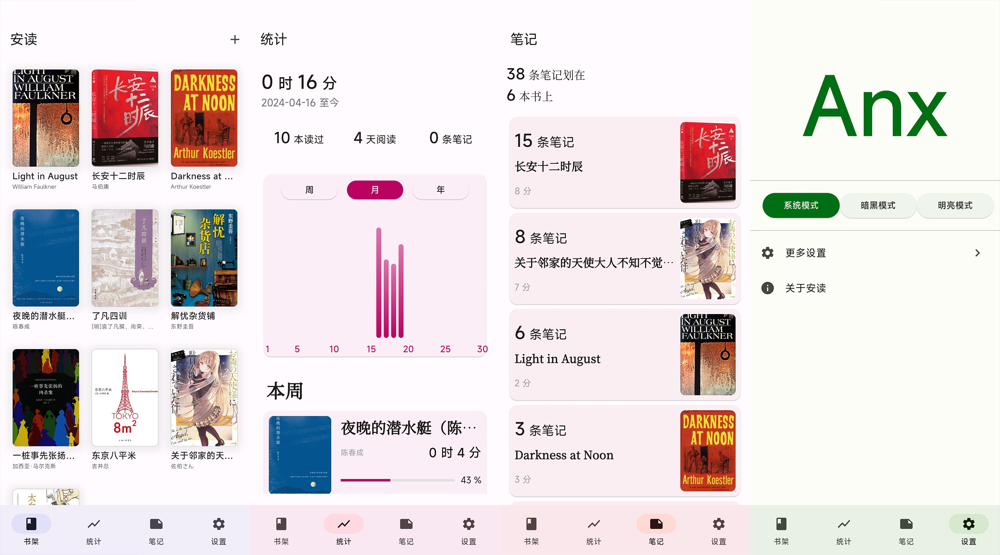

  

<h1 align="center">安读 - 让阅读更专注</h1>

安读是一款专注于阅读的应用，它可以帮助你更专注于阅读，提高阅读效率。

- 自动记录阅读进度，每次打开可以回到上次的进度。
- 丰富且可自定义的阅读配色，让您的阅读更舒适。
- 丰富的阅读设置，包括字号、行间距、字间距等，让阅读更轻松。
- 随时在书中划线，多种样式和配色，随时回顾。
- 强大的阅读统计，记录您的每一次阅读。
- 丰富的阅读笔记功能，让您的阅读更深入。
- 安读可自定义多种色彩主题，满足您的不同需求。
- 想在夜晚更舒适的阅读？安读可以适配系统 深/浅 色模式，或手动切换。
- 安读现已支持多语言（中、英），自动适配系统语言，亦可手动选择。

- [ ] 适配 Tab 端

