**English** | [简体中文](README_zh.md) | [Türkçe](README_tr.md) | [Русский](README_RU.md)

<br>

<p align="center">
  
</p>
<h1 align="center">Anx Reader</h1>
<p align="center"><a href="https://trendshift.io/repositories/10329" target="_blank"></a></p>

<p align="center">
  <a href="https://github.com/Anxcye/anx-reader#platform-support"></a>
  <a href="https://github.com/Anxcye/anx-reader#supported-formats"></a>
</p>

<p align="center">
  <a href="https://github.com/Anxcye/anx-reader/releases/latest"></a>
  <a href="https://github.com/Anxcye/anx-reader/releases"></a>
  <a href="https://github.com/Anxcye/anx-reader/blob/main/LICENSE"></a>
  <a href="https://github.com/Anxcye/anx-reader/releases"></a>
  <a href="https://hellogithub.com/repository/819a2b3050204451bed552a8812114e5" target="_blank"></a>
  <a href="https://github.com/anxcye/anx-reader/stargazers"></a>
</p>

Anx Reader, a thoughtfully crafted e-book reader for book lovers. Featuring powerful AI capabilities and supporting various e-book formats, it makes reading smarter and more focused. With its modern interface design, we're committed to delivering pure reading pleasure.


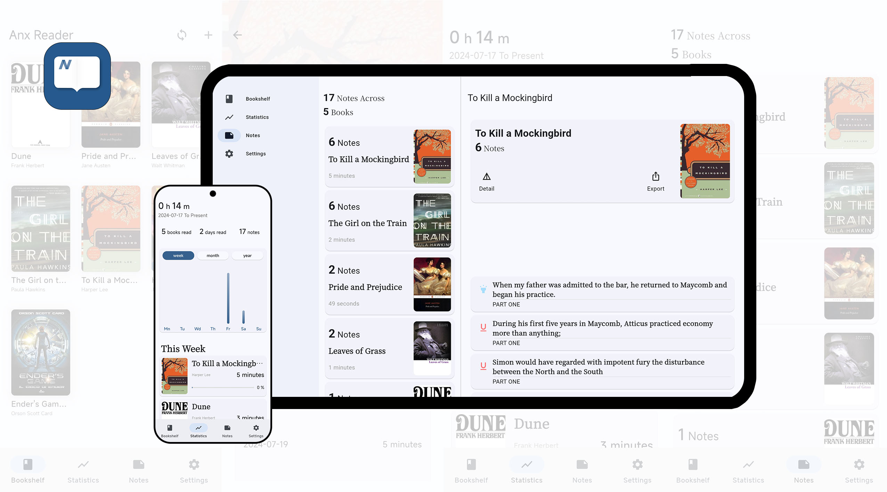


| Feature | Details | Status |
| --- | --- | --- |
| Format Support | EPUB/MOBI/AZW3/FB2/TXT/PDF fully supported | ✅ |
| Cross-Platform Sync | Android/iOS/macOS/Windows coverage<br>Sync books, notes, and reading progress via WebDAV | ✅ |
| AI Assistant | Organizes shelves by progress and tone<br>Generates mind maps for deeper understanding<br>On-demand AI dictionary and translation<br>Delivers perspective analysis and summaries | ✅ |
| Custom Reading Experience | Tune letter, line, paragraph, and margin spacing<br>Adjust font size, style, and weight<br>Customize themes, backgrounds, alignment, and styles | ✅ |
| Notes Workspace | Multiple color/style presets<br>Sort by time or chapter with color filters<br>Export to TXT/Markdown/CSV<br>Create shareable, well-designed cards | ✅ |
| Reading Insights | Track reading time<br>View daily/weekly/monthly/yearly stats<br>Visual heatmap reveals reading habits | ✅ |
| Advanced Extras | TTS with multi-voice, speed, tone, and sleep timer controls<br>Full-book translation with side-by-side view<br>Store books in the cloud and download on demand<br>One-tap simplified/traditional Chinese conversion | ✅ |
| OPDS Catalogs | Built-in OPDS support with custom catalog management | 🛠️ In progress |


<table border="1">
  <tr>
    <th>OS</th>
    <th>Source</th>
  </tr>
  <tr>
    <td>iOS</td>
    <td>
      <a href="https://apps.apple.com/app/anx-reader/id6743196413" target="_blank">
        
      </a>
    </td>
  </tr>
  <tr>
    <td>macOS</td>
    <td>
      <a href="https://apps.apple.com/app/anx-reader/id6743196413" target="_blank"></a>
      <a href="https://github.com/Anxcye/anx-reader/releases/latest" target="_blank"></a>
    </td>
  </tr>
  <tr>
    <td>Windows</td>
    <td>
      <a href="https://github.com/Anxcye/anx-reader/releases/latest" target="_blank">
        
      </a>
    </td>
  </tr>
  <tr>
    <td>Android</td>
    <td>
      <a href="https://github.com/Anxcye/anx-reader/releases/latest" target="_blank">
        
      </a>
      <a href="https://f-droid.org/packages/com.anxcye.anx_reader" target="_blank">
        
      </a>
    </td>
  </tr>
</table>


## Community Projects
The following projects are maintained by the community and not officially supported. For issues or feedback related to these projects, please contact the respective project maintainers.

**Calibre Plugin** [anx-reader-calibre-plugin](https://github.com/ptbsare/anx-reader-calibre-plugin)

A Calibre plugin that enables direct management of your ANX Reader ebook library from Calibre. Particularly useful for NAS users looking to centralize their ebook collection.


**Web Library Manager** [anx-calibre-manager](https://github.com/ptbsare/anx-calibre-manager)

A modern web application for managing your ebook library with Calibre integration and WebDAV server functionality for ANX Reader devices.


## I Encountered a Problem, What Should I Do?
Check [Troubleshooting](./docs/troubleshooting.md#English)

Submit an [issue](https://github.com/Anxcye/anx-reader/issues/new/choose), and we will respond as soon as possible.

Telegram Group: [https://t.me/AnxReader](https://t.me/AnxReader)

QQ Group：1042905699

### Screenshots
| 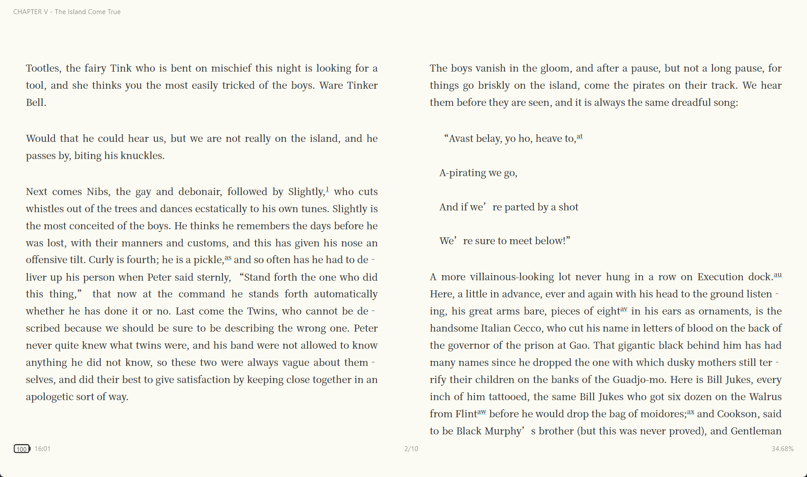 |  |
| :------------------------------: | :----------------------------: |
|   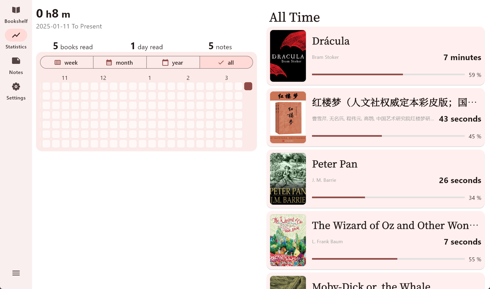   |  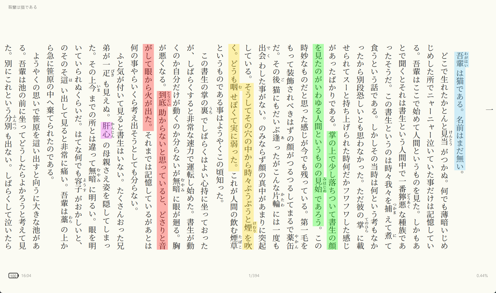  |
|   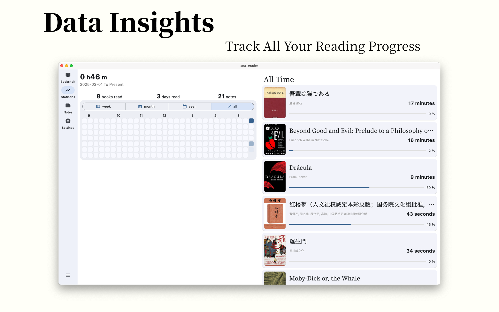   |  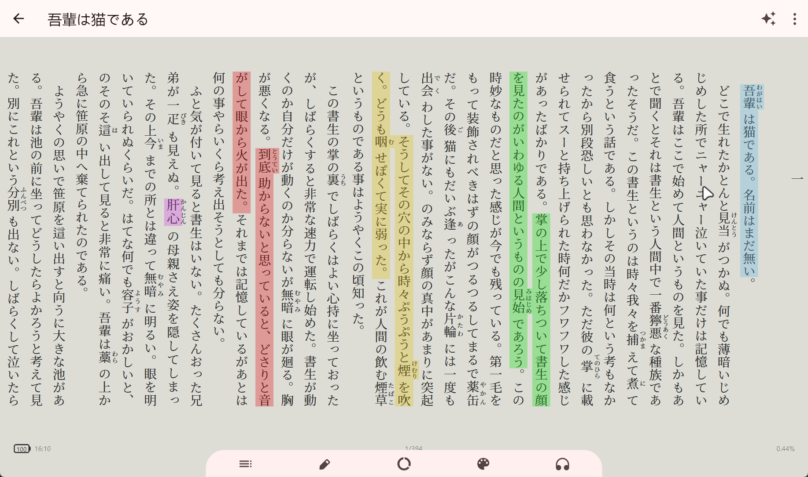  |
|   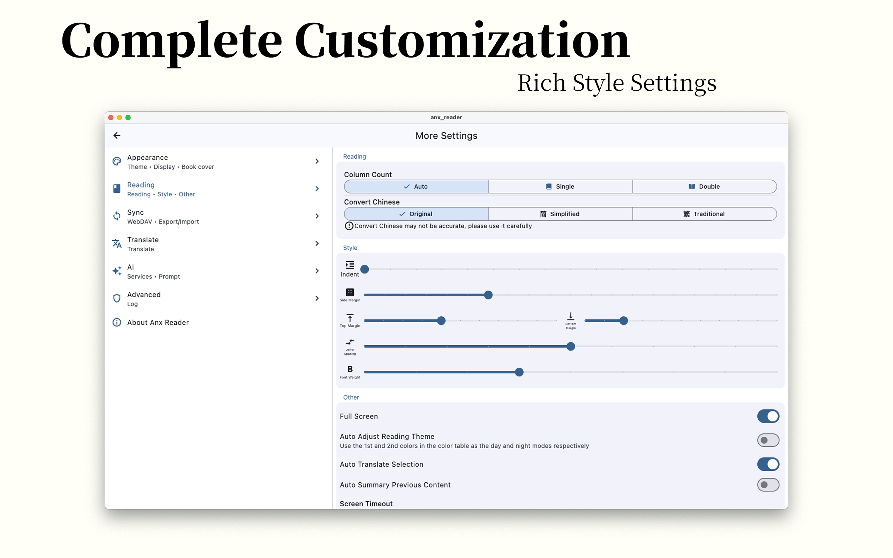   |  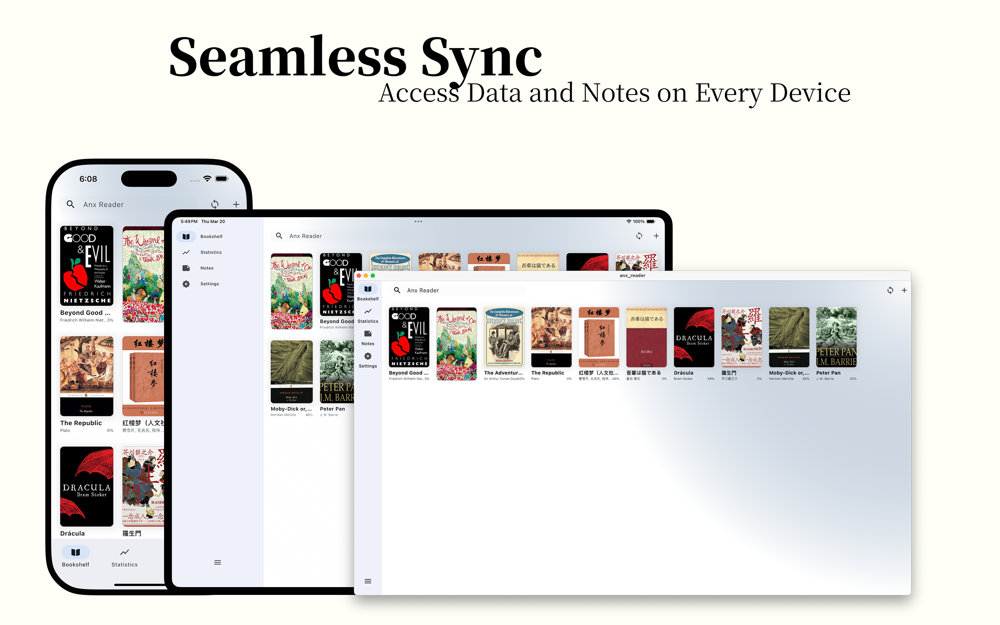  |


| 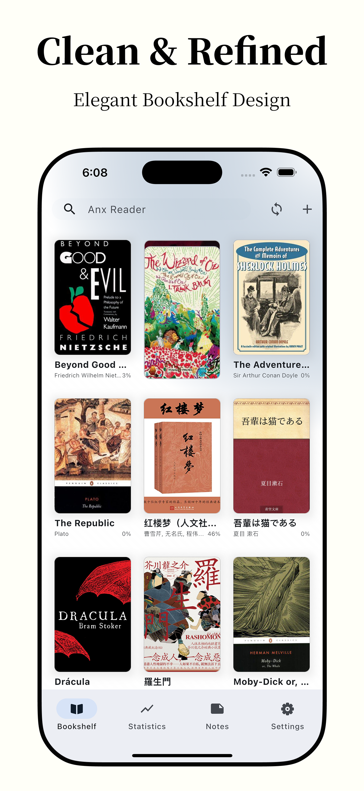 | 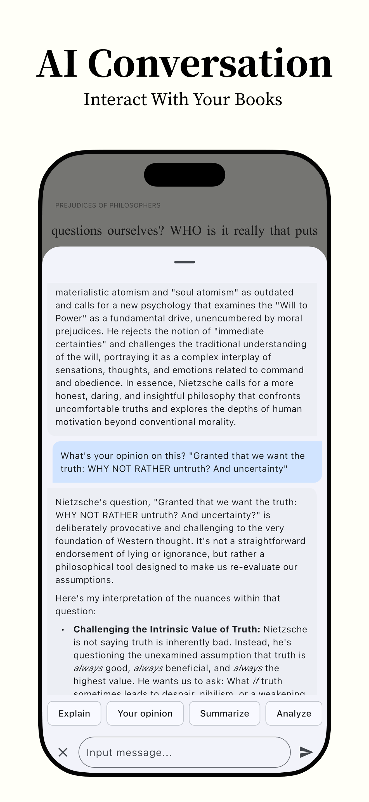 | 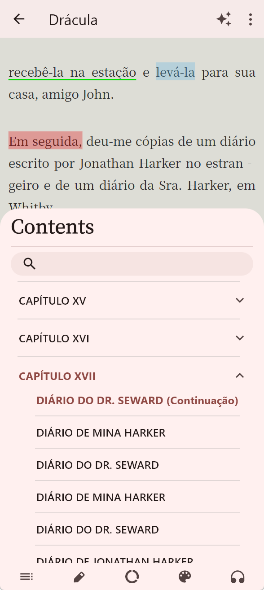 |
| :----------------------------: | :----------------------------: | :----------------------------: |
| 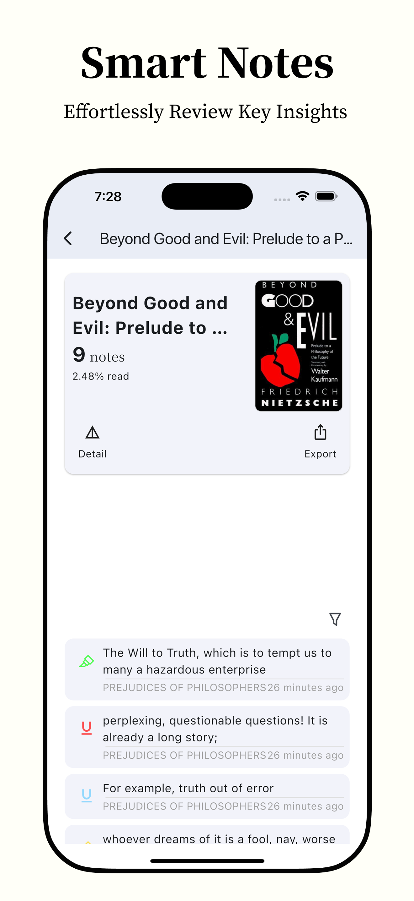 | 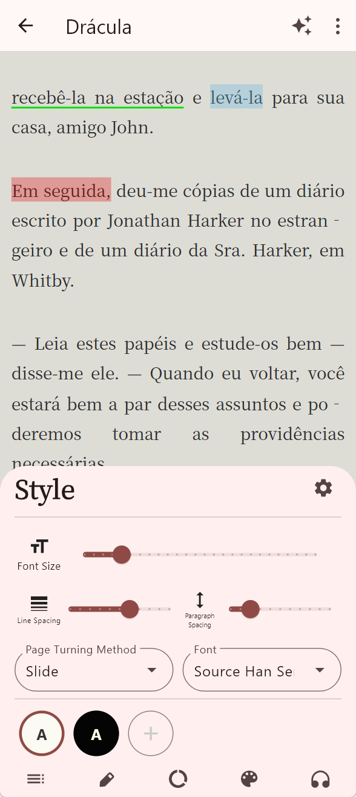 | 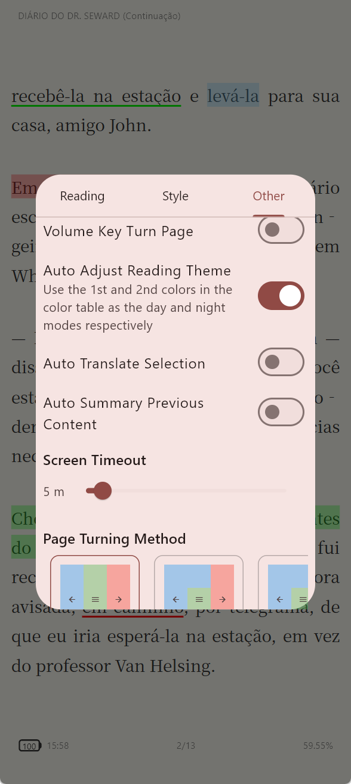 |
| 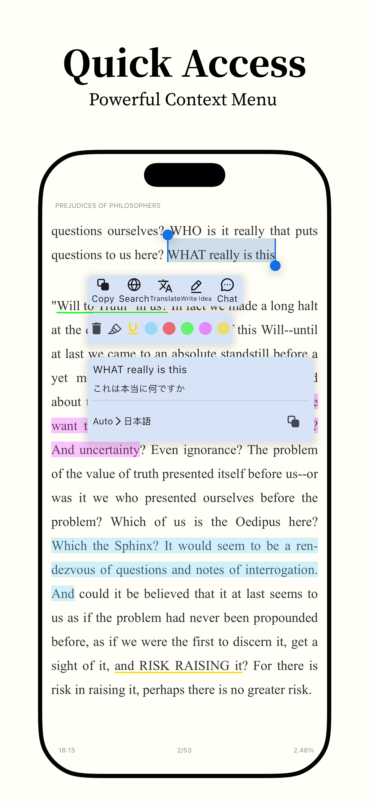 | 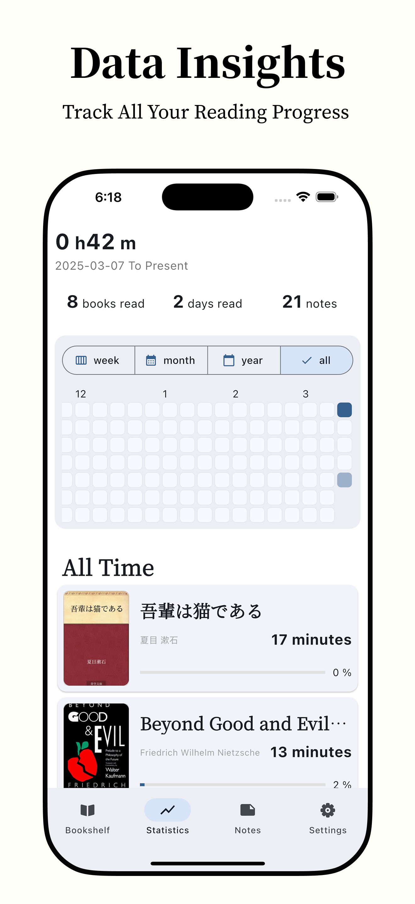 | 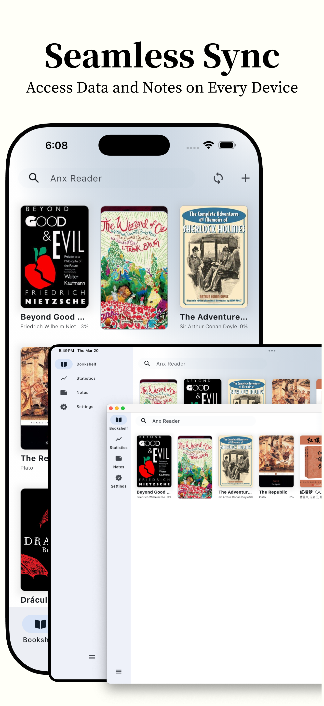 |

## Donations
If you like Anx Reader, please consider supporting the project by donating. Your donation will help me maintain and improve the project.

❤️ [Donate](https://anxcye.com/home/7)

## Building
Want to build Anx Reader from source? Please follow these steps:
- Install [Flutter](https://flutter.dev).
- Clone and enter the project directory.
- Run `flutter pub get`.
- Run `flutter gen-l10n` to generate multi-language files.
- Run `dart run build_runner build --delete-conflicting-outputs` to generate the Riverpod code.
- Run `flutter run` to launch the application.

### Linux

The Linux desktop build uses GTK 3 and CMake. Install your distribution's GTK 3
development package, CMake, Ninja, pkg-config, and a C/C++ compiler first. Use
the Flutter version recorded in `.github/flutter-version`, then run:

```sh
flutter config --enable-linux-desktop
flutter pub get
flutter gen-l10n
dart run build_runner build --delete-conflicting-outputs
flutter build linux --release
```

The runnable bundle is written to `build/linux/x64/release/bundle/`.

You may encounter Flutter version incompatibility issues. Please refer to the [Flutter documentation](https://flutter.dev/docs/get-started/install).


## Code signing policy
- Committers and reviewers: [Members team](https://github.com/anxcye/anx-reader/graphs/contributors)
- Approvers: [Owners](https://github.com/anxcye)
- [Privacy Policy](https://anx.anxcye.com/privacy.html)
- [Terms of Service](https://anx.anxcye.com/terms.html)

### Sponsors
|  | Free code signing on Windows provided by [SignPath.io](https://about.signpath.io/),certficate by [SignPath Foundation](https://signpath.org/) |
|------------------------------------------------------------|-----------------------------------------------------------------------------------------------------------------------------------------------|


## License
This project is licensed under the [MIT License](./LICENSE).

Starting from version 1.1.4, the open source license for the Anx Reader project has been changed from the MIT License to the GNU General Public License version 3 (GPLv3).

After version 1.2.6, the selection and highlight feature has been rewritten, and the open source license has been changed from the GPL-3.0 License to the MIT License. All contributors agree to this change(#116).

## Thanks
[foliate-js](https://github.com/johnfactotum/foliate-js), which is MIT licensed, it used as the ebook renderer. Thanks to the author for providing such a great project.

[foliate](https://github.com/johnfactotum/foliate), which is GPL-3.0 licensed, selection and highlight feature is inspired by this project. But since 1.2.6, the selection and highlight feature has been rewritten.

And many [other open source projects](./pubspec.yaml), thanks to all the authors for their contributions.
