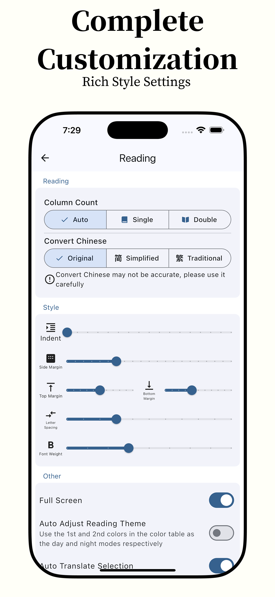

**English** | [简体中文](README_zh.md) | [Türkçe](README_tr.md)

 

  

<h1 align="center">Anx Reader</h1>

  
  
  
  

Anx Reader, a thoughtfully crafted e-book reader for book lovers. Featuring powerful AI capabilities and supporting various e-book formats, it makes reading smarter and more focused. With its modern interface design, we're committed to delivering pure reading pleasure.

**Cross-Platform** iOS/macOS/Windows/Android

**Full Sync** Reading Progress/Book Files/Highlighted Notes

**Multiple AI** OpenAI/Claude/Gemini/DeepSeek

**Insightful Data** Detailed and Intuitive Charts - Weekly/Monthly/Yearly/Heatmap

**Notes** Multiple Ways to Filter/Sort - Export as TXT, Markdown, CSV

**Highly Customizable Styles** Line Spacing/Paragraph Spacing/Margins/Fonts/Color Schemes/Page Turning Methods

**Practical Features** Translation/Search/Quick Ask AI/Write Ideas/Text-to-Speech

<table border="1">
  <tr>
    <th>OS</th>
    <th>Source</th>
  </tr>
  <tr>
    <td>iOS</td>
    <td>
      
    </td>
  </tr>
  <tr>
    <td>macOS</td>
    <td>
      
      
    </td>
  </tr>
  <tr>
    <td>Windows</td>
    <td>
      
    </td>
  </tr>
  <tr>
    <td>Android</td>
    <td>
      
    </td>
  </tr>
</table>

📚 **Rich Format Support**
- Support for major e-book formats: EPUB, MOBI, AZW3, FB2, TXT
- Perfect parsing for optimal reading experience

☁️ **Seamless Sync**
- Cross-device synchronization of reading progress, notes, and books via WebDAV
- Continue your reading journey anywhere, anytime

🤖 **Smart AI Assistant**
- Integration with leading AI services: OpenAI, DeepSeek, Claude, Gemini
- Intelligent content summarization and reading position recall for enhanced efficiency

🎨 **Personalized Reading Experience**
- Carefully designed theme colors with customization options
- Switch freely between scrolling and pagination modes
- Import custom fonts to create your personal reading space

📊 **Professional Reading Analytics**
- Comprehensive reading statistics
- Weekly, monthly, and yearly reading reports
- Intuitive reading heatmap to track every moment of your reading journey

📝 **Powerful Note System**
- Flexible text annotation features
- Export options in TXT, CSV, and Markdown formats
- Easily organize and share your reading insights

🛠️ **Practical Tools**
- Smart TTS reading to rest your eyes
- Full-text search for quick content location
- Instant word translation to enhance reading efficiency

💻 **Cross-Platform Support**
- Seamless experience on Android / Windows / MacOS / iOS
- Consistent user interface across devices

### TODO
- [X] UI adaptation for tablets
- [X] Page-turning animation
- [X] TTS voice reading
- [X] Reading fonts
- [X] Translation
- [ ] Full-text translation
- [ ] Support for more file types (pdf)
- [X] Support for WebDAV synchronization
- [ ] Support for Linux

### I Encountered a Problem, What Should I Do?
Check [Troubleshooting](./docs/troubleshooting.md#English)

Submit an [issue](https://github.com/Anxcye/anx-reader/issues/new/choose), and we will respond as soon as possible.

Telegram Group: [https://t.me/AnxReader](https://t.me/AnxReader)

QQ Group：1042905699

### Screenshots
|  |  |
| :------------------------------: | :----------------------------: |
|      |    |
|      |    |
|      |    |

|  |  |  |
| :----------------------------: | :----------------------------: | :----------------------------: |
|  |  |  |

## Donations
If you like Anx Reader, please consider supporting the project by donating. Your donation will help me maintain and improve the project.

❤️ [Donate](https://anxcye.com/home/7)

## Building
Want to build Anx Reader from source? Please follow these steps:
- Install [Flutter](https://flutter.dev).
- Clone and enter the project directory.
- Run `flutter pub get`.
- Run `flutter gen-l10n` to generate multi-language files.
- Run `dart run build_runner build --delete-conflicting-outputs` to generate the Riverpod code.
- Run `flutter run` to launch the application.

You may encounter Flutter version incompatibility issues. Please refer to the [Flutter documentation](https://flutter.dev/docs/get-started/install).

## Code signing policy
- Committers and reviewers: [Members team](https://github.com/anxcye/anx-reader/graphs/contributors)
- Approvers: [Owners](https://github.com/anxcye)
- [Privacy Policy](https://anx.anxcye.com/privacy.html)
- [Terms of Service](https://anx.anxcye.com/terms.html)

### Sponsors
|  | Free code signing on Windows provided by [SignPath.io](https://about.signpath.io/),certficate by [SignPath Foundation](https://signpath.org/) |
|------------------------------------------------------------|-----------------------------------------------------------------------------------------------------------------------------------------------|

## License
This project is licensed under the [MIT License](./LICENSE).

Starting from version 1.1.4, the open source license for the Anx Reader project has been changed from the MIT License to the GNU General Public License version 3 (GPLv3).

After version 1.2.6, the selection and highlight feature has been rewritten, and the open source license has been changed from the GPL-3.0 License to the MIT License. All contributors agree to this change(#116).

## Thanks
[foliate-js](https://github.com/johnfactotum/foliate-js), which is MIT licensed, it used as the ebook renderer. Thanks to the author for providing such a great project.

[foliate](https://github.com/johnfactotum/foliate), which is GPL-3.0 licensed, selection and highlight feature is inspired by this project. But since 1.2.6, the selection and highlight feature has been rewritten.

And many [other open source projects](./pubspec.yaml), thanks to all the authors for their contributions.

