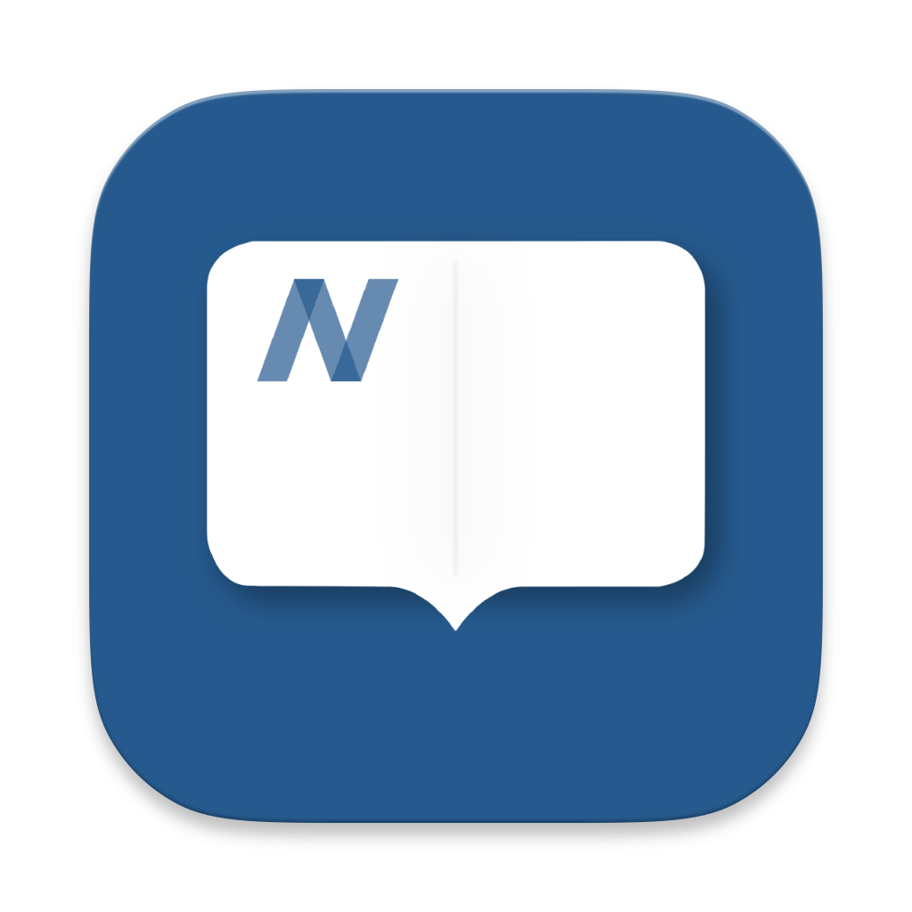

**English** | [简体中文](README_zh.md)

 

  

<h1 align="center">Anx Reader</h1>

  
  
  
  

Anx Reader is an application focused on reading, without any online promotional content. It can help you concentrate more on reading and improve your reading efficiency.

Support **epub / mobi / azw3 / fb2**

- More comprehensive synchronization features. Supports using WebDAV to sync reading progress, notes, and book files.
- Rich and customizable reading color schemes for a more comfortable reading experience.
- Powerful reading statistics to record your every reading session.
- Rich reading note-taking features for deeper reading.
- Interface adapted for phones and tablets.

### TODO
- [X] UI adaptation for tablets
- [X] Page-turning animation
- [X] TTS voice reading
- [X] Reading fonts
- [ ] Translation
- [ ] Support for more file types (txt, pdf)
- [X] Support for WebDAV synchronization
- [ ] Support for Windows, Linux

### I Encountered a Problem, What Should I Do?
Check [Troubleshooting](./docs/troubleshooting.md#English)

Submit an [issue](https://github.com/Anxcye/anx-reader/issues/new/choose), and we will respond as soon as possible.

Telegram Group: [https://t.me/AnxReader](https://t.me/AnxReader)

## Building
Want to build Anx Reader from source? Please follow these steps:
- Install [Flutter](https://flutter.dev).
- Clone and enter the project directory.
- Run `flutter pub get`.
- Run `flutter gen-l10n` to generate multi-language files.
- Run `flutter run` to launch the application.

You may encounter Flutter version incompatibility issues. Please refer to the [Flutter documentation](https://flutter.dev/docs/get-started/install).

# License
Anx Reader is licensed under the [GPL-3.0 License](./LICENSE).

Starting from version 1.1.4, the open source license for the Anx Reader project has been changed from the MIT License to the GNU General Public License version 3 (GPLv3).

## Thanks
[foliate-js](https://github.com/johnfactotum/foliate-js), which is MIT licensed, it used as the ebook renderer. Thanks to the author for providing such a great project.

[foliate](https://github.com/johnfactotum/foliate), which is GPL-3.0 licensed, selection and highlight feature is inspired by this project.

And many [other open source projects](./pubspec.yaml), thanks to all the authors for their contributions.

