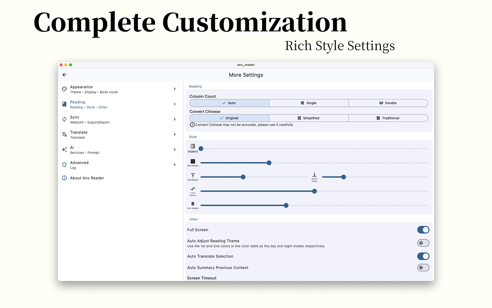
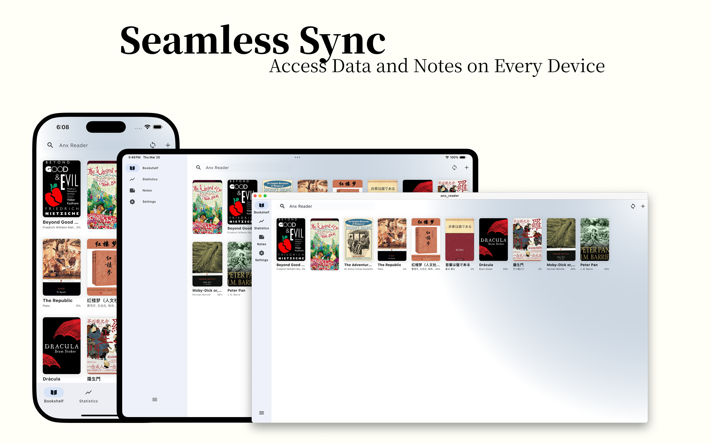
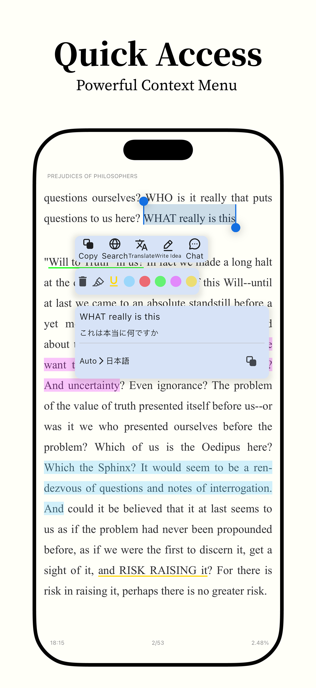
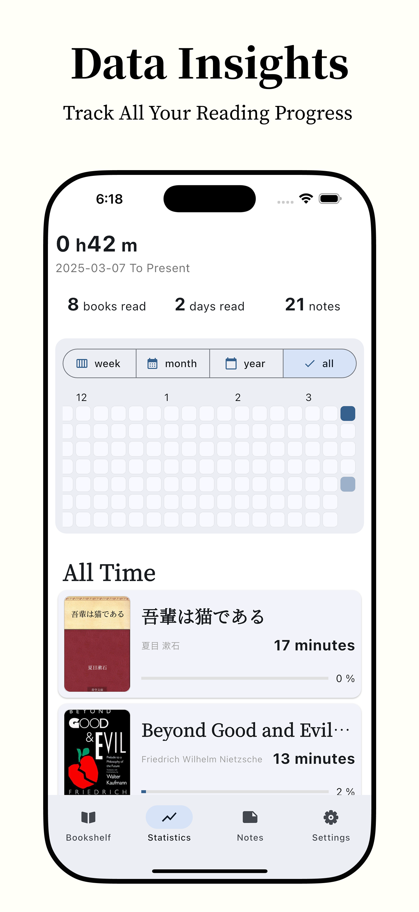
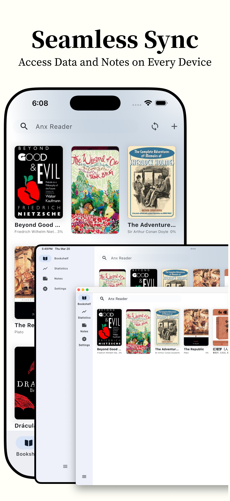

**English** | [简体中文](README_zh.md) | [Türkçe](README_tr.md) | [Русский](README_RU.md)

 

  

<h1 align="center">Anx Reader</h1>

  
  

  
  
  
  
  
  

Anx Reader — продуманная читалка электронных книг для любителей чтения. Оснащена мощными возможностями искусственного интеллекта и поддерживает различные форматы электронных книг, делая чтение умнее и сосредоточеннее. Благодаря современному дизайну интерфейса мы стремимся подарить вам чистое удовольствие от чтения.

**Кроссплатформенная** iOS/macOS/Windows/Android

**Полная синхронизация** Прогресс чтения / Файлы книг / Выделенные заметки

**Множество ИИ** OpenAI / Claude / Gemini / DeepSeek

**Полезная аналитика** Детализированные и наглядные графики — еженедельно / ежемесячно / ежегодно / тепловая карта

**Заметки** Множество способов фильтрации и сортировки — экспорт в TXT, Markdown, CSV

**Высокая настройка стилей** Межстрочный интервал / Интервал между абзацами / Поля / Шрифты / Цветовые схемы / Способы перелистывания

**Практичные функции** Перевод / Поиск / Быстрые вопросы ИИ / Запись идей / Озвучивание текста

<table border="1">
  <tr>
    <th>ОС</th>
    <th>Ссылка</th>
  </tr>
  <tr>
    <td>iOS</td>
    <td>
      
    </td>
  </tr>
  <tr>
    <td>macOS</td>
    <td>
      
      
    </td>
  </tr>
  <tr>
    <td>Windows</td>
    <td>
      
    </td>
  </tr>
  <tr>
    <td>Android</td>
    <td>
      
    </td>
  </tr>
</table>

📚 **Поддержка форматов**  
- Поддержка основных форматов электронных книг: EPUB, MOBI, AZW3, FB2, TXT  
- Идеальный парсинг для оптимального чтения  

☁️ **Бесшовная синхронизация**  
- Синхронизация прогресса чтения, заметок и книг между устройствами через WebDAV  
- Продолжайте чтение где угодно и когда угодно  

🤖 **Умный ИИ-ассистент**  
- Интеграция с ведущими ИИ-сервисами: OpenAI, DeepSeek, Claude, Gemini  
- Автоматическое создание кратких содержаний и запоминание позиции чтения для повышения эффективности  

🎨 **Персонализированный опыт чтения**  
- Продуманная цветовая тема с возможностью настройки  
- Свободное переключение между прокруткой и постраничным режимом  
- Импорт пользовательских шрифтов для создания личного пространства чтения  

📊 **Профессиональная аналитика чтения**  
- Полная статистика чтения  
- Еженедельные, ежемесячные и ежегодные отчёты  
- Наглядная тепловая карта чтения для отслеживания каждого момента  

📝 **Мощная система заметок**  
- Гибкие возможности аннотирования текста  
- Экспорт заметок в форматах TXT, CSV и Markdown  
- Лёгкая организация и обмен впечатлениями от чтения  

🛠️ **Практичные функции**  
- Умное озвучивание текста (TTS) для отдыха глаз  
- Поиск по всему тексту для быстрого нахождения информации  
- Мгновенный перевод слов для повышения эффективности чтения  

💻 **Кроссплатформенная поддержка**  
- Бесшовный опыт на Android / Windows / MacOS / iOS  
- Единый пользовательский интерфейс на всех устройствах

### Список задач/дел
- [X] Адаптация интерфейса для планшетов  
- [X] Анимация перелистывания страниц  
- [X] Озвучивание текста (TTS)  
- [X] Шрифты для чтения  
- [X] Перевод  
- [ ] Полный перевод текста  
- [ ] Поддержка дополнительных форматов (pdf)  
- [X] Поддержка синхронизации через WebDAV  
- [ ] Поддержка Linux  

### Возникла проблема? Что делать?  
Проверьте раздел [Устранение неполадок](./docs/troubleshooting.md#English)

Создайте [issue](https://github.com/Anxcye/anx-reader/issues/new/choose), и мы ответим как можно скорее.

Группа в Telegram: [https://t.me/AnxReader](https://t.me/AnxReader)

Группа в QQ: 1042905699

### Скриншоты
|  |  |
| :------------------------------: | :----------------------------: |
|      |    |
|      |    |
|      |    |

|  |  |  |
| :----------------------------: | :----------------------------: | :----------------------------: |
|  |  |  |
|  |  |  |

## Пожертвования  
Если вам нравится Anx Reader, пожалуйста, рассмотрите возможность поддержки проекта пожертвованиями. Ваша помощь поможет поддерживать и развивать проект.

❤️ [Пожертвовать](https://anxcye.com/home/7)

## Сборка  
Хотите собрать Anx Reader из исходников? Пожалуйста, выполните следующие шаги:  
- Установите [Flutter](https://flutter.dev).  
- Клонируйте репозиторий и перейдите в каталог проекта.  
- Выполните `flutter pub get`.  
- Выполните `flutter gen-l10n` для генерации файлов мультиязычности.  
- Выполните `dart run build_runner build --delete-conflicting-outputs` для генерации кода Riverpod.  
- Запустите приложение командой `flutter run`.  

Возможно, вы столкнётесь с проблемами совместимости версий Flutter. Пожалуйста, ознакомьтесь с [документацией Flutter](https://flutter.dev/docs/get-started/install).

## Политика подписания кода  
- Коммитеры и рецензенты: [Команда участников](https://github.com/anxcye/anx-reader/graphs/contributors)  
- Утверждающие: [Владельцы](https://github.com/anxcye)  
- [Политика конфиденциальности](https://anx.anxcye.com/privacy.html)  
- [Условия использования](https://anx.anxcye.com/terms.html)

### Спонсоры  
|  | Бесплатное подписание кода на Windows предоставлено [SignPath.io](https://about.signpath.io/), сертификат выдан [SignPath Foundation](https://signpath.org/) |
|------------------------------------------------------------|-----------------------------------------------------------------------------------------------------------------------------------------------|

## Лицензия  
Этот проект лицензирован под [MIT License](./LICENSE).

Начиная с версии 1.1.4, лицензия проекта Anx Reader была изменена с MIT License на GNU General Public License версии 3 (GPLv3).

После версии 1.2.6 функция выделения и подсветки была переписана, и лицензия была изменена с GPL-3.0 на MIT License. Все участники согласны с этим изменением (#116).

## Благодарности  
[foliate-js](https://github.com/johnfactotum/foliate-js), лицензированный по MIT, используется в качестве рендерера электронных книг. Спасибо автору за отличный проект.

[foliate](https://github.com/johnfactotum/foliate), лицензированный по GPL-3.0, вдохновил функцию выделения и подсветки. Начиная с версии 1.2.6, эта функция была переписана.

И многим [другим open source проектам](./pubspec.yaml), спасибо всем авторам за их вклад.
