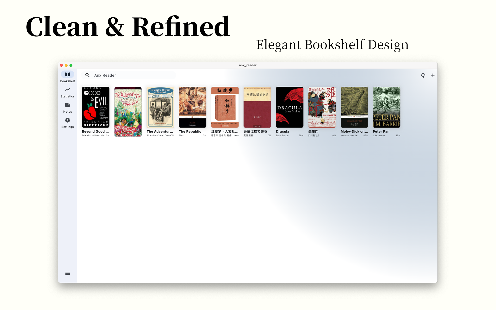
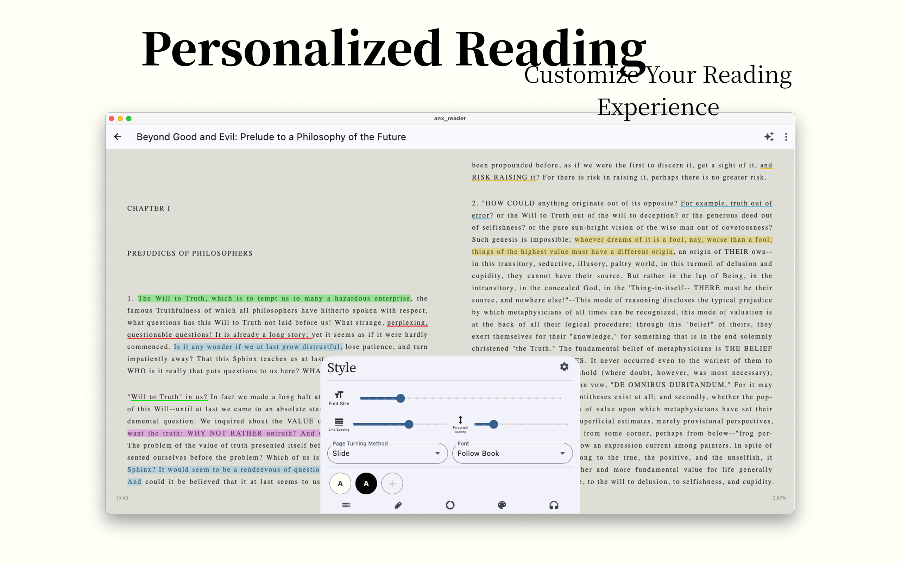
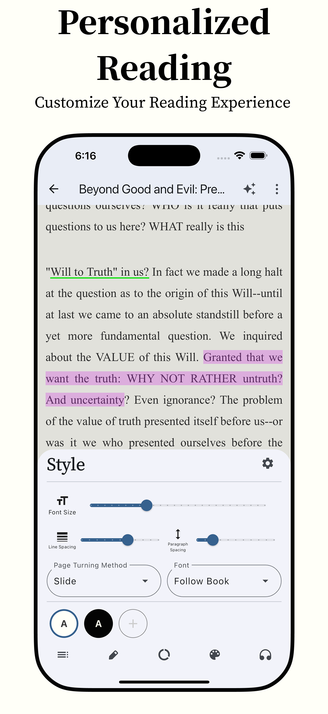
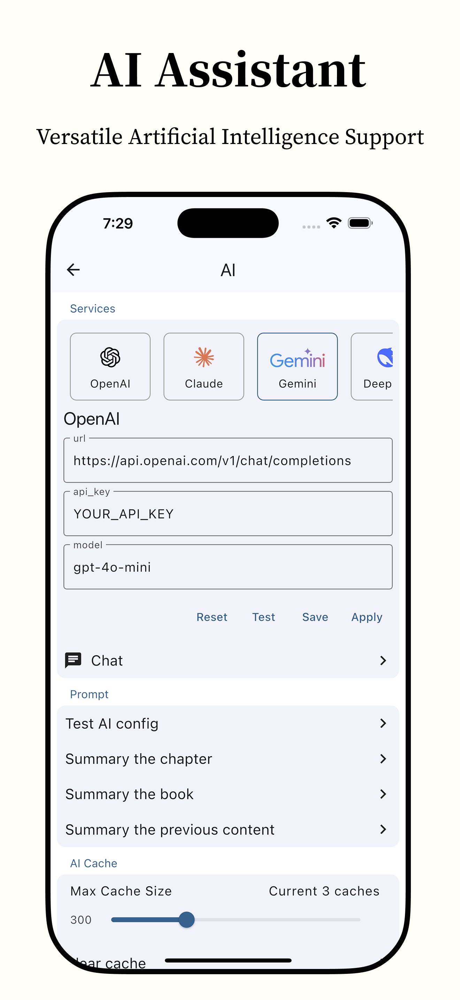

# Anx Reader

**[English](README.md)** | **Türkçe** | [简体中文](README_zh.md)
 
> [!WARNING]
> Some features or descriptions may be outdated. Please check the [English README](README.md) for the latest information.  
> Feel free to help us update this translation by submitting a PR!

 

  

<h1 align="center">Anx Reader</h1>

  
  
  
  

Anx Reader, çevrimiçi tanıtım içeriği olmadan tamamen okuma odaklı bir uygulamadır. Daha iyi odaklanmanıza yardımcı olarak okuma verimliliğinizi artırır.

**Desteklenen formatlar:**  
**epub / mobi / azw3 / fb2 / txt**  

Android ve Windows için kullanılabilir.

- Daha kapsamlı senkronizasyon özellikleri. WebDAV kullanarak okuma ilerlemesini, notları ve kitap dosyalarını senkronize edebilirsiniz.
- Konforlu bir okuma deneyimi için zengin ve özelleştirilebilir renk şemaları.
- Okuma alışkanlıklarınızı takip etmenizi sağlayan güçlü okuma istatistikleri.
- Derinlemesine okuma için gelişmiş not alma özellikleri.
- Telefon ve tabletler için optimize edilmiş arayüz.

## TODO (Yapılacaklar)
- [X] Tabletler için UI uyarlaması
- [X] Sayfa çevirme animasyonu
- [X] TTS (Metinden sese) okuma
- [X] Okuma yazı tipleri
- [X] Çeviri
- [ ] Tam metin çeviri desteği
- [ ] Daha fazla dosya türü desteği (PDF)
- [X] WebDAV senkronizasyon desteği
- [ ] Linux ve MacOS desteği

## Bir Sorunla Karşılaştım, Ne Yapmalıyım?
- [Sorun Giderme](./docs/troubleshooting.md#English) bölümüne göz atın.
- Bir [sorun bildirin](https://github.com/Anxcye/anx-reader/issues/new/choose), en kısa sürede yanıtlayacağız.

**Telegram Grubu:** [https://t.me/AnxReader](https://t.me/AnxReader)

## Ekran Görüntüleri
|  |  |
| :------------------------------: | :----------------------------: |
|      |    |
|      |    |
|      |    |

|  |  |  |
| :----------------------------: | :----------------------------: | :----------------------------: |
|  |  |  |

## Bağış Yapın
Eğer Anx Reader’ı beğendiyseniz, projeyi desteklemek için bağış yapmayı düşünebilirsiniz. Bağışlarınız, projenin bakımını ve geliştirilmesini sürdürebilmemize yardımcı olur.

❤️ [Bağış Yap](https://anxcye.com/home/7)

## Derleme (Build) İşlemi
Anx Reader’ı kaynak kodundan derlemek mi istiyorsunuz? Aşağıdaki adımları takip edin:

- [Flutter](https://flutter.dev) yükleyin.
- Proje dizinine gidin ve klonlayın.
- `flutter pub get` komutunu çalıştırın.
- Çok dilli destek dosyalarını oluşturmak için `flutter gen-l10n` çalıştırın.
- Riverpod kodunu oluşturmak için `dart run build_runner build --delete-conflicting-outputs` çalıştırın.
- Uygulamayı başlatmak için `flutter run` komutunu çalıştırın.

Flutter sürüm uyumsuzlukları ile karşılaşabilirsiniz. Lütfen [Flutter belgelerine](https://flutter.dev/docs/get-started/install) göz atın.

## Lisans
Anx Reader, [GPL-3.0 Lisansı](./LICENSE) altında lisanslanmıştır.  

Sürüm 1.1.4'ten itibaren, Anx Reader projesinin açık kaynak lisansı, MIT Lisansından GNU Genel Kamu Lisansı sürüm 3 (GPLv3) olarak değiştirilmiştir.

## Teşekkürler
- [foliate-js](https://github.com/johnfactotum/foliate-js) (MIT lisanslı), e-kitap görüntüleyici olarak kullanılmaktadır. Bu harika projeyi sağladığı için yazara teşekkür ederiz.
- [foliate](https://github.com/johnfactotum/foliate) (GPL-3.0 lisanslı), seçim ve vurgulama özelliği bu projeden ilham almıştır.
- Ve birçok [diğer açık kaynak projeler](./pubspec.yaml), katkıda bulunan tüm yazarlara teşekkürler!
