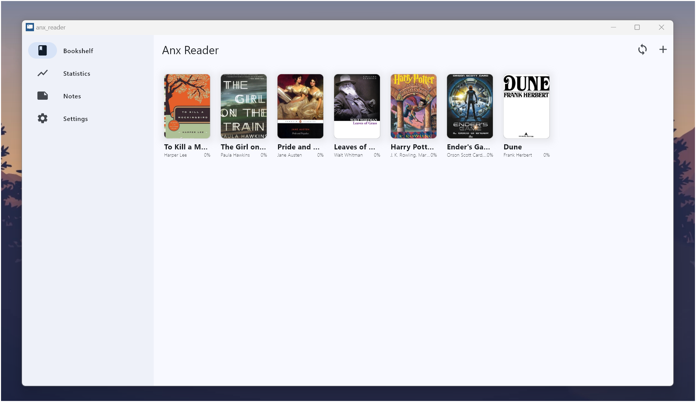
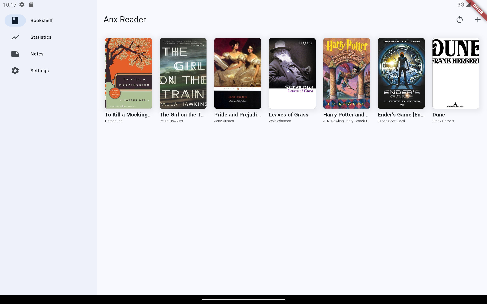
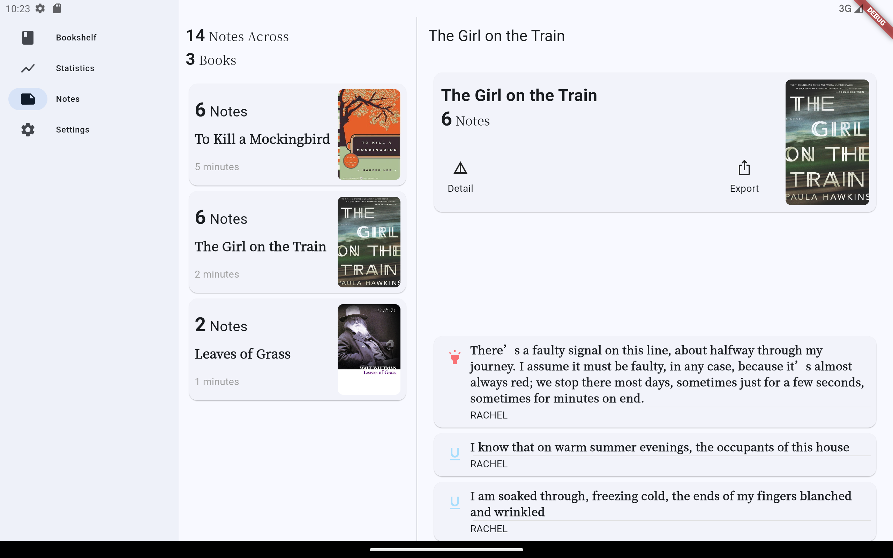
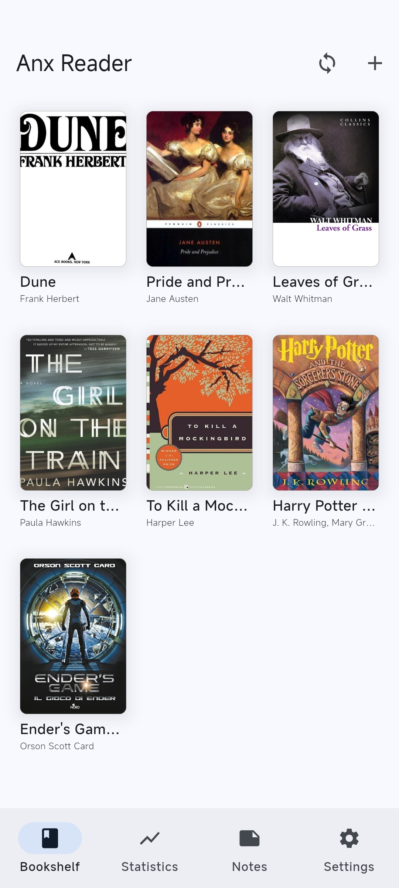
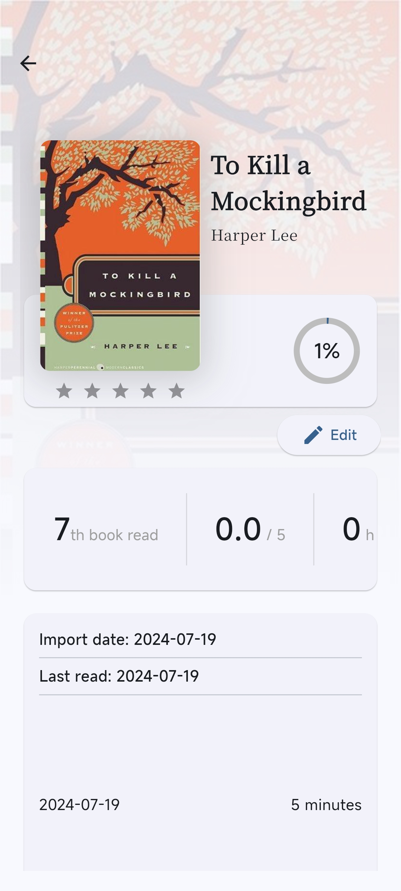
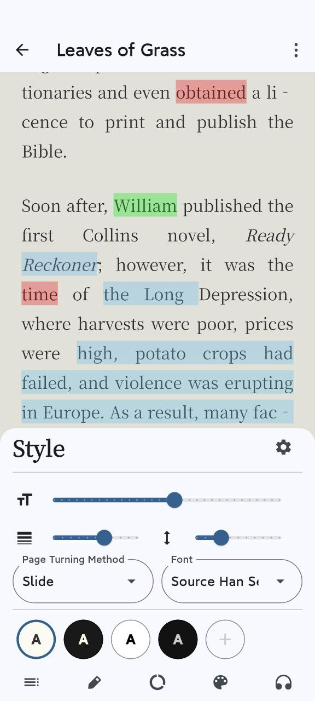
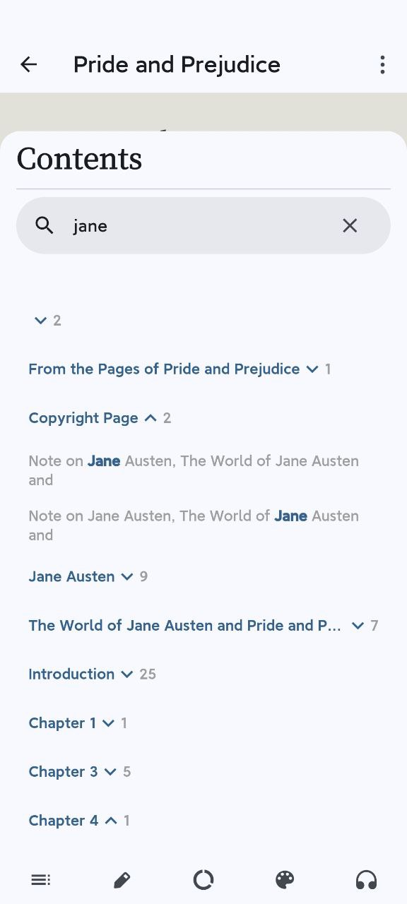

[English](README.md) | **简体中文** | [Türkçe](README_tr.md)

  

<h1 align="center">安读 - 让阅读更专注</h1>

  
  
  
  

安读，一款为热爱阅读的你精心打造的电子书阅读器。集成多种 AI 能力，支持丰富的电子书格式，让阅读更智能、更专注。现代化界面设计，开源免费，无广告干扰，只为提供纯粹的阅读体验。

📚 **丰富的格式支持**
- 支持主流电子书格式：EPUB、MOBI、AZW3、FB2、TXT
- 完美解析，确保最佳阅读体验

☁️ **无缝同步体验**
- 通过 WebDAV 跨设备同步阅读进度、笔记和书籍
- 随时随地继续您的阅读之旅

🤖 **智能 AI 助手**
- 集成多款顶尖 AI 服务：OpenAI、DeepSeek、Claude、Gemini
- 智能总结内容、回忆阅读位置，让阅读更有效率

🎨 **个性化阅读体验**
- 精心设计的主题配色，支持自定义
- 滚动/分页模式自由切换
- 支持导入自定义字体，打造专属阅读空间

📊 **专业的阅读追踪**
- 详尽的阅读数据统计
- 支持周、月、年度阅读报告
- 直观的阅读热力图，记录每一刻阅读时光

📝 **强大的笔记系统**
- 灵活的文本批注功能
- 支持导出为 TXT、CSV、Markdown 格式
- 轻松整理和分享您的读书心得

🛠️ **实用工具集**
- TTS 智能朗读，解放双眼
- 全文搜索，快速定位内容
- 即时划词翻译，提升阅读效率

💻 **跨平台支持**
- 完美支持 Android 与 Windows 系统
- 统一的用户体验，无缝切换设备

### TODO
- [X] UI 适配 Tab 端
- [X] 翻页动画
- [X] TTS 语音朗读
- [X] 阅读字体
- [X] 翻译
- [ ] 全文翻译
- [ ] 支持更多文件类型（pdf）
- [X] 支持 WebDAV 同步
- [ ] 支持 Linux, MacOS

### 我遇到了问题，怎么办？
查看[故障排除](./docs/troubleshooting.md#简体中文)

提出一个[issue](https://github.com/Anxcye/anx-reader/issues/new/choose)，将会尽快回复。

Telegram 群组：[https://t.me/AnxReader](https://t.me/AnxReader)

### 截图
| **windows** |  **Android Tablet**|
|:--:|:-:|
|  |  |

|  |  ||
|:--:|:--:|:--:|
|  |  | |

## 捐赠
如果你喜欢安读，请考虑捐赠支持项目。您的支持将帮助我优化功能、修复问题，并为您带来更好的阅读体验！感谢您的慷慨支持！

❤️ [捐赠](https://anxcye.com/home/7)

## 构建
希望从源码构建安读？请参考以下步骤：
- 安装 [Flutter](https://flutter.dev)。
- 克隆并进入项目目录。
- 运行 `flutter pub get` 。
- 运行 `flutter gen-l10n` 生成多语言文件。
- 运行 `dart run build_runner build --delete-conflicting-outputs` 生成 Riverpod 代码。
- 运行 `flutter run` 启动应用。

您可能遇到 Flutter 版本不兼容的问题，请参考 [Flutter 文档](https://flutter.dev/docs/get-started/install)。

