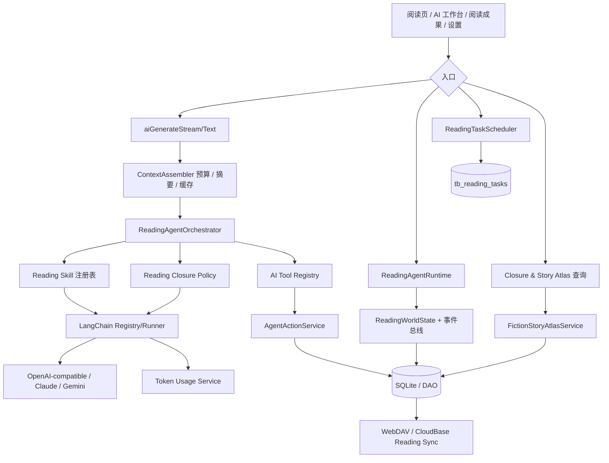

# Anx Reader AI 架构

> 状态：随代码维护的实现架构说明（2026-08）。本文记录当前已经落地的能力、边界和扩展契约；产品交互与权限决策以 [`DESIGN.md`](../../DESIGN.md) 为准。

开发者快速索引：先看 [`feature-map.md`](feature-map.md) 的能力总表和“不要重复实现”列，再回到本文阅读 AI 执行链路。

## 1. 目标与原则

Anx Reader 的 AI 不是阅读页上的一次性问答按钮，而是由阅读现场、可选的阅读方法、受控工具和可撤销写入组成的本地优先运行时。核心原则是：

- 普通翻页、停留、回看只更新本地状态，不调用模型。
- 模型调用必须由用户发起的问答、分析、翻译或确认后的整理动作触发。
- 原文、用户事实和 AI 推断分层保存，并保留来源和剧透边界。
- 所有持久化 AI 写入通过统一动作服务，支持即时撤销、30 天内撤销和冲突保护。
- 同步只同步阅读数据，不在后台触发 AI；云端不可用时本地阅读和 AI 仍可用。

### Book Wiki 执行边界

`BookWikiService` 是 Wiki 唯一查询投影层，合并结构化 Wiki Entry、Story
Atlas Artifact 与 Markdown 记忆，并统一应用 `visibleFromProgress`。页面不直查
DAO，也不拼 Prompt。`BookWikiGenerationService` 只接受用户确认后由活跃阅读器
提供的章节文本，按章节校验证据并通过 `AgentActionService` 写入；内容哈希未变时
跳过。全书模式不改变本地默认可见边界。`BookWikiExportService` 只导出当前允许
显示的投影，并附来源和事实/推断标识。

### ReadingChunk 与 Reading Evidence Resolver

`ReadingChunker` 是用户确认后的整理任务使用的短生命周期分块层。它优先在段落、
句末和换行处切分，并为每个 chunk 保留原章节的 UTF-16 `startOffset`/`endOffset`、
内容哈希和 pipeline 版本；chunk 正文不写入新表，checkpoint 只保存元数据。Wiki
生成和 Story Atlas 的超长章节统一复用此分块器，因此内容变化或 pipeline 变化会自然
失效，普通翻页不会计算 chunk。

`ReadingEvidenceResolver` 是页面无关的来源安全边界。它依次尝试原文子串、空白/全
半角标点归一化和仅去除引用外壳的确定性匹配，并返回从原章节切出的 `exactText` 与
字符范围。无法安全定位的模型证据被拒绝，绝不由模型补写或用模糊关键词替代。优先
chunk 范围既用于选择重复证据，也是不可越过的范围约束。

## 2. 总体分层

## 3. 能力矩阵

| 层 | 当前能力 | 是否自动调用模型 | 主要实现 |
|---|---|---:|---|
| AI 底座 | 流式/文本生成、元数据、取消、重试、供应商切换、Key 轮换 | 按入口 | `service/ai/index.dart`、`langchain_runner.dart` |
| 工作台 | 会话历史、上下文恢复、选区动作、阅读模式、分析模板 | 用户提交后 | `widgets/ai/ai_reading_workspace.dart`、`providers/ai_chat.dart` |
| 阅读运行时 | 稳定位置、章节 checkpoint、目标、难点、画像、掌握度、卡片和记忆恢复 | 否 | `reading_agent_runtime.dart` |
| 阅读方法 | 10 种 Reading Skill，catalog/summary/full 渐进加载 | 需要时 | `reading_skills.dart` |
| 阅读闭环 | 小说沉浸、知识论证、心理反思的目标/成果声明 | 需要时 | `reading_closure_policy.dart` |
| 受控动作 | 导航、笔记、难点、目标预览、记忆、小说 Artifact | 写入按权限 | `tools/reading_agent_tools.dart`、`agent_action_service.dart` |
| 小说档案 | 人物、关系、事件、线索、悬念、时间线和关系图 | 确认整理后 | `fiction_backfill_service.dart`、`fiction_story_atlas_service.dart` |
| 用量 | 输入/输出/合计 Token、请求数、服务端 usage 优先、本地估算回退 | 否 | `ai_token_usage_service.dart` |

## 4. 一次 AI 请求的调用链

### 普通对话/阅读问答

1. `AiChat.sendMessageStream` 捕获当前书、章节、CFI、进度和会话。
2. 阅读中由 `ReadingAgentOrchestrator.prepare` 判断是否需要专家；简单任务直接交给主助手，复杂任务最多并行两个专家。编排器只组装一次受限的共享上下文快照，专家返回经过长度、数量和来源校验的 `EvidenceObject`，不再把完整专家长文塞回主对话。
3. `ReadingSkillMatcher` 选择当前 Reading Skill；普通请求只加载 summary，深度分析或明确方法意图才加载 full guidance。
4. `ContextAssembler` 在不改写本地完整历史的前提下，为发送给 provider 的副本应用任务预算、最近消息窗口和本地滚动摘要，并合并重复的 Skill/Closure/System 片段。
5. `aiGenerateStream` 进入统一 LangChain runner，完成 provider 选择、队列、RPM、超时、重试、取消和流式输出。
6. runner 把服务端 usage 或估算 usage 交给 `AiTokenUsageService`，会话和 trace/citation 写回 AI history。

### 专家编排预算与降级

专家调用使用独立的 `expertAnalysis` 上下文类别：单专家最多约 6,000 输入 Token、预留 1,200 输出 Token；共享快照再按专家策略限制为 5,000 Token，单专家最多输出 4 条证据。每条证据只保留主张、简短依据、不确定性、置信度和实际检索得到的来源 URL，压缩结果写入 Agent trace。

联网搜索失败时，专家降级为仅基于共享快照分析；单个专家、超时或结构化输出失败不影响其他专家。若仍有有效 Evidence，主助手核对后使用；若全部失败，则原始对话直接进入主助手，既不阻塞回答，也不制造引用。

### 明确写入与撤销

用户明确要求保存/创建/标记时，工具先校验当前书、有效来源和 Beta 权限，再由 `AgentActionService` 在同一事务中写入业务表和动作快照。返回结果包含撤销入口；撤销会检查版本/更新时间，若用户后来修改过则拒绝覆盖并报告冲突。导航不进入动作日志。

### 小说档案整理

成果页的“整理/更新故事档案”只显示确认预览；确认后 `FictionBackfillService` 按当前安全边界读取已读章节，最多 6 章/批、24,000 字符/批、并发 2，并以内容哈希 checkpoint 支持恢复。输出必须绑定章节、正文快照、`sourceProgress` 和 `visibleFromProgress`，失败不覆盖已有 Artifact。图谱和时间线只由 `FictionStoryAtlasService` 查询，打开页面不会触发模型。

## 5. 模型供应商与执行层

`LangChainProviderRegistry` 以新 Provider 配置为权威，同时兼容 legacy AI 配置。协议覆盖 OpenAI-compatible、Anthropic/Claude 和 Gemini。`LangChainRunner` 是对话与工具 Agent 的共同执行层；`RequestQueue` 负责并发/RPM，`AiKeyRotator` 负责多 Key，失败可切换备用供应商。所有入口都应复用 `aiGenerateStream`、`aiGenerateText` 或 `aiGenerateTextWithMetadata`，不要在页面直接创建供应商客户端。

网络搜索是显式能力：Tavily、Brave 或自定义 HTTP 可选，默认关闭并支持可信域名过滤；搜索失败必须降级，不能伪造 citation。阅读事件、同步和成果页加载均不得隐式开启搜索。

## 6. 三个容易混淆的概念

| 概念 | 回答的问题 | 负责什么 | 不负责什么 |
|---|---|---|---|
| Reading Agent Runtime | “现在阅读现场发生了什么？” | 世界状态、事件、目标、低打扰策略、权限和动作 | 决定采用哪种分析方法 |
| Reading Skill | “用什么方法理解内容？” | 苏格拉底教学、论证拆解、人物追踪等方法和提示指导 | 不直接写数据库、不等于工具集合 |
| Reading Closure Policy | “这本书怎样算形成成果？” | 目标模板、checkpoint、mastery、成果 section、快捷问题 | 不执行模型调用 |

`BookReadingProfile` 保存按书的主闭环、内容特征、置信度和用户固定；它用于选择闭环，不替代 Reading Skill 的按书偏好设置。当前 Reading Skill 的 pinned 配置仍位于 `Prefs().readingSkillsByBook`。

## 7. 工具、权限与来源

通用工具包括计算器、当前时间、思维导图、书籍/章节/目录查询、全文搜索、书架/笔记/历史/标签查询。Reading Agent Beta 工具包括：

- `reader_navigate`：仅当前书合法 CFI/Href，提供返回原位置。
- `reading_note_create`：必须有当前选区或明确有效来源，保存原文快照、章节、模型和会话。
- `reading_difficulty_save`：沿用难点去重和重新打开规则。
- `reading_goal_set`：只生成结构化预览，确认后保存。
- `reading_memory_append/recall`：Markdown 记忆写入/按需读取；正文不自动进入世界状态 prompt。
- `fiction_artifact_save`、`fiction_character_recall`：小说档案和人物即时回忆。

用户启用列表会过滤工具；Beta 关闭时 Reading Agent 工具不可用。Agent 主动建议只能生成建议卡，不能自动写入。所有来源应标注 `createdBy`、`epistemicStatus`、章节、CFI、快照和摄入模式。

## 8. 持久化真相层

SQLite 是本地真相源，当前数据库版本为 21。主要表按职责分为：

- 会话：`tb_ai_sessions`。
- 阅读状态：`tb_reading_goals`、`tb_reading_checkpoints`、`tb_reading_mastery`、`tb_reading_difficulties`、`tb_knowledge_cards`。
- 用户方法与记忆：`tb_reader_profile_items`、`tb_book_reading_profiles`、`tb_reading_memory_documents`。
- 可追溯产物：`tb_reading_artifacts`、笔记及其 source/block/AI batch 表。
- 动作与删除：`tb_agent_actions`、`tb_reading_sync_tombstones`。
- 中途开始与多设备：`tb_book_reading_coverage`、`tb_book_device_positions`。

Artifact 的剧透字段必须保持分离：`sourceProgress` 是内容发生位置，`visibleFromProgress` 是可展示边界，`ingestedAt` 是进入系统的时间，`ingestionMode` 区分 live/backfill/imported/synced。未知 Artifact kind 应保留并由页面安全忽略。

## 9. 同步与多设备

`ReadingAgentSyncService` 以书和设备生成增量包；WebDAV 与 CloudBase 只是 transport。同步流程为：捕获本地变更 → 下载同书各设备包 → 按表合并 → 恢复本设备位置 → 重新捕获并上传。

- 位置按 `(book, deviceId)` 保存；其他设备的进度不会覆盖本机当前位置。
- 全局最远进度只用于主动提示“继续当前位置/跳转到最远进度”，不自动跳转，也不作为手动故事整理的默认上限。
- 目标按每书单 active 规则解决；Artifact/笔记/难点/卡片/记忆按稳定 ID、更新时间、状态和 tombstone 合并。
- Agent action 日志不跨设备同步，避免重复撤销；CloudBase 同步需要登录，其他阅读和 AI 能力不受影响。
- 同步不调用模型；登录、网络和远端错误只影响同步，不影响本地阅读。

## 10. Token 用量与可观测性

AI 设置中的 Token 用量面板展示本月输入、输出、合计和请求数。统一 runner 记录聊天、阅读 Agent、翻译和小说回填等入口；服务端真实 usage 优先，缺失时使用本地估算并标记为估算。按自然月自动切换，数据默认只保存在本机，不参与偏好备份或阅读同步。日志可用于定位 provider、模型、重试和失败，但不得记录 API Key 或不必要的全文正文。

### 上下文预算层

`AiContextAssembler` 位于所有 `aiGenerate*` 公共入口和 provider runner 之间。任务按 `general`、`readingChat`、`translation`、`chapterReview`、`fictionBackfill`、`noteOrganizer` 使用不同的输入上限、预留输出、最近消息数和摘要预算。调用方应显式传入最接近的任务类型；未声明时使用 `general`。

- 本地会话继续保存完整消息；预算只作用于临时 provider prompt 副本。
- 长会话保留最近消息，较早消息以本地确定性摘要压缩，不为摘要额外调用模型。
- 最新显式用户消息永远完整保留；单条请求超过预算时允许本次估算超限，而不是静默截断。
- 输出预算同时映射到 OpenAI/Claude 的 `maxTokens` 与 Gemini 的 `maxOutputTokens`，用户设置更低时保留较低值，更高时按任务上限限制。
- Skill、Closure、World State 片段按规范化内容去重；Tool Catalog 不再复制到 system prompt，工具 schema 仍由 runner 单独传递。
- 静态 prompt、World State 和滚动摘要使用小型 LRU；内容 fingerprint 变化自然失效，阅读会话开始/结束时显式清理对应书籍的 World State scope。
- Token 用量基于最终发送的压缩 prompt 记录；日志只记录估算数量和压缩条数，不记录全文。

## 10.1 统一任务状态机

`ReadingTaskScheduler` 为阅读 AI 工作提供单一状态机和优先级队列。任务状态为 `queued/running/paused/completed/failed/cancelled`，优先级为 `background/normal/userInitiated/critical`；同优先级 FIFO，高优先级在下一个安全点协作式抢占可暂停任务。暂停、取消与恢复不直接杀死数据库事务或正在返回的 provider 响应。

短任务可以是内存态，长任务使用 `tb_reading_tasks` 保存输入 payload、checkpoint、进度、尝试次数和错误。进程重启后，原 queued/running 任务统一恢复为 paused，避免应用启动时自动调用云模型；任务类型重新注册 executor 并经用户恢复后才继续。小说档案回填已接入此调度层，Artifact 批次 checkpoint 继续承担幂等数据恢复。

## 11. 安全、隐私与低打扰边界

- API Key 仅从配置读取，不写入 AI history、Artifact 或同步包。
- 原文只在用户请求或确认整理的范围内进入模型；小说回填不越过 `safeKnowledgeBoundary`。
- 任何推断都不能伪装成用户确认事实；关系图和时间线显示“文本事实/AI 推测”来源。
- 阅读页普通事件本地处理；状态胶囊只显示短标题、进度和数量，不展示生成式长文本。
- 用户消息、手动导航和关闭操作始终可中断 Agent 工作。

## 12. 扩展契约

### 新增书类

在 `ReadingClosurePolicyRegistry` 注册稳定字符串 closure ID、声明式目标/checkpoint/mastery/成果 section/快捷问题和 guidance。提供 `BookReadingProfile` 的匹配特征即可；阅读页和成果页通过声明式 ViewModel 渲染，不添加按书类的硬编码分支。契约测试应能注册假的第四种书类并完整显示。

### 新增 Skill

实现 catalog、summary、full 三层内容，加入本地 matcher 和 reader-facing 文案；Skill 只描述阅读方法，不注册工具、不直接写库。需要成果时通过 Closure Policy 声明贡献类型。

### 新增工具

在 `AiToolRegistry` 注册 schema、启用条件、当前书/来源校验和权限级别。持久化动作必须调用 `AgentActionService`；导航类工具必须声明非持久化。

### 新增 Provider

扩展 `AiProviderProtocol` 和 LangChain registry/runner 适配，复用统一队列、重试、取消和 usage 记录；不要在 UI 或业务服务中复制 provider 逻辑。

## 13. 已知边界与技术债

- Reading Skill 按书固定仍使用 SharedPreferences，尚未迁移为可同步配置。
- Agent action log 目前是本机审计记录，不做跨设备合并。
- 小说档案一期不支持人物合并、字段编辑和错误纠正，只能撤销后重新整理。
- Token 估算不是供应商计费账单，服务端缺失 usage 时只能作为近似值。
- 没有后台定时唤醒、向量数据库、跨书知识图谱或自动 Skill 学习。

## 14. 关键代码索引

| 主题 | 文件 |
|---|---|
| AI 公共入口、上下文与供应商 | `lib/service/ai/index.dart`, `ai_context_assembler.dart`, `langchain_registry.dart`, `langchain_runner.dart`, `langchain_ai_config.dart` |
| 任务状态与调度 | `lib/models/reading_task.dart`, `lib/service/ai/reading_task_scheduler.dart`, `lib/dao/reading_task.dart` |
| 聊天与历史 | `lib/providers/ai_chat.dart`, `lib/service/ai/ai_history.dart`, `lib/dao/ai_session.dart` |
| 阅读运行时 | `lib/service/ai/reading_agent_runtime.dart`, `lib/models/reading_agent.dart`, `reading_agent_repository.dart` |
| 方法与闭环 | `lib/service/ai/reading_skills.dart`, `reading_closure_policy.dart`, `reading_experience_profile_service.dart` |
| 工具与写入 | `lib/service/ai/tools/ai_tool_registry.dart`, `tools/reading_agent_tools.dart`, `agent_action_service.dart` |
| 小说档案 | `fiction_backfill_service.dart`, `fiction_story_atlas_service.dart`, `fiction_character_graph_page.dart`, `fiction_story_timeline_page.dart` |
| 同步 | `lib/service/sync/reading_agent_sync_service.dart`, `cloudbase_reading_sync_coordinator.dart`, `cloudbase_reading_sync_transport.dart` |
| 用量 | `lib/service/ai/ai_token_usage_service.dart`, `lib/page/settings_page/ai.dart` |

## 15. 变更验证清单

- 新入口是否复用 `aiGenerate*` 和统一 runner？
- 普通阅读路径是否零模型调用、零模态打断？
- 是否明确区分来源进度、展示边界、摄入时间？
- 所有 AI 写入是否有确认规则、动作快照和幂等撤销？
- 新数据是否声明同步合并规则和 tombstone 行为？
- 新书类/Skill/工具/Provider 是否通过扩展契约而无需修改阅读页核心？
- 是否补充测试、文档索引和 `git diff --check`？
