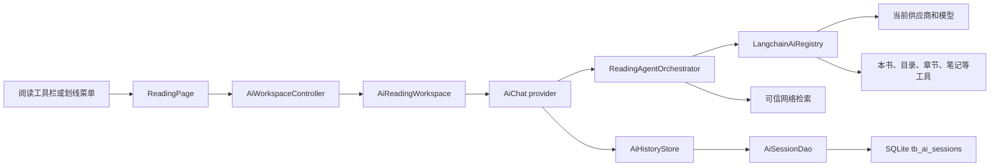

# AI 阅读工作台与深度阅读改造实施记录

## Record Metadata

- Status: Implemented
- Release line: v1.15.0
- Source branch: `feature/v1.15.0`
- Recorded at: 2026-08-11
- Database version: 11
- Related future work: [AI 主动阅读闭环](../todo/ai-active-reading-coach.md)

本文记录当前代码中已经落地的 AI 阅读能力、关键决策和验证证据。它描述的是实现事实，不包含尚未实现的检视阅读向导、四个主动问题、章节自测和难点暂存箱。

## Why This Change Exists

改造前的 AI 入口主要表现为一个临时对话框：阅读上下文弱、历史导航不完整、设置入口与实际配置能力不一致，划线后通常只能拼接一次性 prompt。对历史、心理和理财等不同读物，也缺少稳定的角色边界、来源策略和安全约束。

本次改造采用以下产品原则：

- AI 区域是独立阅读工作台，而不是阅览器上的一次性弹窗。
- 对话、草稿、滚动位置和历史导航状态不能因隐藏面板而丢失。
- 阅读模式按书保存，主助手根据任务复杂度决定是否调度专家。
- 划线先生成待处理上下文，用户选择动作后才发起模型请求。
- 外部来源默认关闭，启用后也必须经过模式对应的可信域名过滤。
- 深度阅读框架是产品内的本地实现，不依赖外部 skill 运行时。

## User Entry Points

### 阅读工作台

- 阅读页顶部工具栏点击“AI 对话”。
- 宽度不小于 600 px 时，在右侧或底部显示可调尺寸工作区。
- 小于 600 px 时使用全屏工作区，系统返回键先关闭 AI，再返回阅读页。
- 关闭只隐藏工作区，不销毁当前会话、输入草稿和滚动位置。

### 划线交互

- 长按选中文本，直接选择一级入口“AI”；单词、短语和段落均无需先展开“更多”。
- 工作台展示选区动作卡，不立即请求模型。
- 动作卡根据当前阅读模式排序，可执行解释、联系全书、史料核查、反思对话、风险检查等动作。
- “加入笔记”直接保存原划线和摘要，不需要调用模型。
- “深度分析”先展示深度、框架、输出形式和阅读目标，确认后发送。

### 历史和设置

- 工作台标题栏的历史按钮进入对话历史，历史页和详情页都有明确“返回”。
- 历史默认按当前书过滤，可切换为全部会话。
- 恢复当前书会话时，同时恢复消息、阅读模式、分析配置和原阅读位置。
- 工作台设置按钮进入“专家与来源”，可调整本书阅读模式、分析深度、输出形式、专家开关、网络检索和可信来源。
- 全局路径为“设置 > AI”，包含阅读模式、深度阅读、专家、网络检索和可信来源五个配置区。

## Implemented Capability Matrix

### Reading Modes

| Mode | Primary behavior | Selection actions | Safety boundary |
| --- | --- | --- | --- |
| General | Text explanation and synthesis | Explain, contextualize, connect to book, add note | Separate sourced facts from interpretation |
| History | Chronology, provenance and contested interpretations | Source lookup, timeline, fact check, explain | Distinguish primary sources and later interpretation |
| Psychology | Concepts, reflection and optional exercises | Explain, reflection, exercise, contextualize | No diagnosis or treatment claims |
| Finance | Assumptions, calculations and downside risk | Explain, validate assumption, calculate, risk check | No personalized investment instruction |

模式可以由本地关键词和一次轻量 AI 建议产生，但必须由用户确认。每本书的选择覆盖全局默认，切换只影响后续请求。

### Deep-Reading Analysis

深度分析将 [deep-reading-analyst-skill](https://github.com/ginobefun/deep-reading-analyst-skill) 的分析理念适配为项目内的 Dart 领域模型、提示构造和 UI，没有引入该仓库作为依赖，也没有运行外部 skill。

| Depth | Expert limit | Default framework direction |
| --- | ---: | --- |
| Quick | 0 | SCQA, 5W2H |
| Standard | 1 | Critical thinking, inversion |
| Deep | 2 | First principles, systems thinking |
| Research | 2 | Critical thinking, systems thinking, optional trusted web research |

支持六种框架：SCQA、5W2H、批判性思维、反向思考、第一性原理和系统思维。框架推荐在本地完成，依据分析深度、阅读模式、阅读目标和划线文本，最多选择两个框架。

支持四种输出形式：学习笔记、论证分析、概念图和实践计划。分析提示明确要求区分原文事实、作者观点、模型推断和未知信息，并禁止声称读过未读取的内容。

### Multi-Agent Orchestration

- 简单问题由主助手直接回答，不产生额外模型调用。
- 长问题、来源核查、时间线、比较、计算和风险类任务才进入专家规划。
- 专家数量由深度限制，任何单轮最多两个。
- 专家与主助手共用当前 AI 供应商和模型，不要求独立模型配置。
- 专家并行执行，结果作为证据草稿交给主助手统一核对、去重和回答。
- 每次执行保存 `AgentRunTrace`，包含专家、动作、状态、耗时、输出、来源 URL 和降级原因。
- 专家失败或来源不足不会阻断主助手，界面显示降级状态而不是伪造结果。

### Trusted Web Research

- 网络检索默认关闭，只有研究档、全局授权和有效供应商配置同时满足时才启用。
- 支持 Tavily、Brave Search 和自定义 HTTP 兼容接口。
- 内置通用、历史、心理和理财可信来源包，用户可以按模式覆盖域名。
- 只接受 HTTPS，并按完整主机名或可信子域匹配，拒绝相似恶意域名。
- 超时、无 Key、HTTP 错误、响应损坏、无结果和无可信结果均返回明确降级状态。
- 网络结论和专家来源保存到会话 citations，历史详情可继续查看。

### Reading Tools

AI 工具注册表当前包含计算器、时间、思维导图、书内搜索、书架查询与整理、笔记搜索、阅读历史、当前阅读元数据、当前目录、当前章节、按 href 读取章节、标签查询和标签应用。

工具由用户启用列表过滤，并通过 Riverpod `WidgetRef` 获取当前阅读状态和仓储能力。章节正文只在模型需要时读取，普通对话不会预先注入整章或整本书。

## Architecture And Data Flow



主要实现入口：

- [AI workspace UI](../../lib/widgets/ai/ai_reading_workspace.dart)
- [Workspace state](../../lib/providers/ai_workspace.dart)
- [Reading domain models](../../lib/service/ai/reading_ai_models.dart)
- [Deep-reading frameworks](../../lib/service/ai/reading_frameworks.dart)
- [Agent orchestration](../../lib/service/ai/reading_agent_orchestrator.dart)
- [Trusted web search](../../lib/service/ai/web_search.dart)
- [History persistence](../../lib/service/ai/ai_history.dart)

## Public Models And Responsibilities

| Interface | Responsibility |
| --- | --- |
| `ReadingAiMode` | General, history, psychology and finance modes |
| `ReadingContextSnapshot` | Book, chapter, selection, surrounding text, progress and CFI metadata |
| `ReadingAnalysisRequest` | Depth, frameworks, output template, goal and web permission |
| `ReadingAnalysisResult` | Persisted analysis summary, sections and citations |
| `ReadingAgentProfile` | Mode prompt, action order, safety rules, tools and trusted sources |
| `AgentRunTrace` | Expert execution evidence and degradation state |
| `AiReadingSession` | Stable session representation independent of a specific chat SDK |
| `AiWorkspaceController` | Visibility, internal navigation, mode, selection, draft and scroll state |
| `WebSearchProviderConfig` | Provider, endpoint, credentials, headers, timeout and trusted domains |

## Persistence And Migration

AI 历史由缓存目录中的 `ai_history.json` 迁移到 SQLite `tb_ai_sessions`。数据库版本 10 创建会话表，版本 11 增加深度阅读字段。

每条会话保存以下信息：

- 会话 ID、标题、供应商、模型、创建和更新时间。
- `bookId`、书名、章节标题、章节 href 和阅读模式。
- 阅读上下文快照，包括 CFI 和阅读进度。
- 消息、完成状态、专家轨迹和 citations。
- 分析深度、框架、输出形式、阅读目标和分析结果。

旧 JSON 首次读取时按 ID 插入，不覆盖数据库已有会话。迁移成功后旧文件改名为 `.backup`；损坏 JSON 不写数据库，也不删除原文件。历史数量继续受现有最大缓存数量限制。

SQLite 数据随现有数据库同步链路同步。远端数据库版本高于当前应用时，继续使用项目已有的版本不匹配保护。

## Runtime Failure Handling

- AI 主供应商出现可识别错误后，复用现有备用供应商链路继续请求。
- 无效或不可运行的备用供应商会被清除，避免重复失败。
- 隐藏或退出流式界面会取消活动请求，防止后台继续生成。
- 搜索和专家失败以 `degraded` 或 `failed` 记录，主会话仍可保存。
- 历史先写入未完成草稿，再在流完成时更新为完成状态；异常时保留已生成内容和失败状态。

## Verification Evidence

2026-08-11 在 `feature/v1.15.0` 工作区执行：

```bash
flutter test \
  test/providers/ai_workspace_test.dart \
  test/service/ai/reading_ai_models_test.dart \
  test/service/ai/reading_agent_orchestrator_test.dart \
  test/service/ai/reading_analysis_prefs_test.dart \
  test/service/ai/web_search_test.dart \
  test/service/ai_history_test.dart \
  test/dao/database_migration_test.dart
```

结果：31 tests passed。覆盖工作台状态保持、阅读模式持久化、框架推荐、专家数量限制、联网授权、可信域名过滤、会话序列化、旧 JSON 迁移和数据库版本升级。

同日执行 `flutter analyze --no-pub`：没有 error 或 warning，存在 39 条项目级 info，其中包括既有的弃用 API 和异步 `BuildContext` 提示。该结果不是零告警基线。

## Known Boundaries

- 当前工作台解决的是上下文对话和结构化深度分析，不等于完整主动阅读方法。
- 检视阅读向导、四个主动问题、章节自测和难点暂存箱尚未实现，详见 Future Feature 文档。
- 第一版阅读模式固定为通用、历史、心理和理财，不开放用户自定义 Agent 编排。
- 多 Agent 共用同一模型，复杂任务会增加延迟和调用成本。
- 联网研究依赖用户自行配置供应商和 Key，默认保持关闭。
- 工作台部分新增文案仍直接写在 Dart UI 中，尚未全部迁移到 ARB 本地化资源。
- 当前自动化测试集中在领域模型、持久化和服务层；宽屏分栏、移动全屏、跨书恢复和 E-INK 仍需要真机或 Widget 验收补充。
