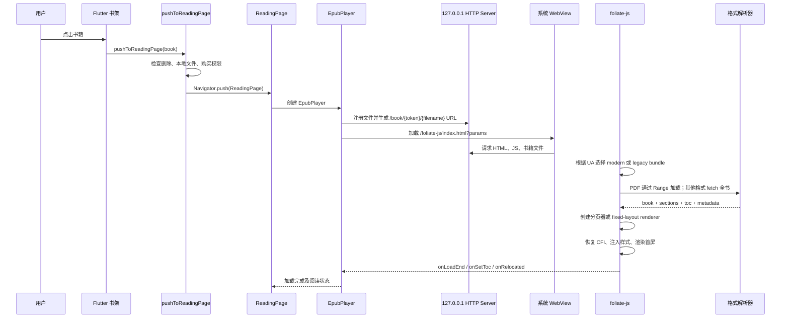

# 图书打开、解析与渲染链路

## 文档元数据

- 状态：当前实现记录、修复证据与剩余风险审计
- 记录时间：2026-08-12
- 代码基线：`codex/ai-active-reading-coach`，提交 `5ef718cc`
- 适用版本：`1.15.0+6325`
- 覆盖平台：Android、iOS、macOS、Windows、HarmonyOS
- 核心渲染器：项目内 fork 的 foliate-js + PDF.js

本文是后续 AI、开发者和排障人员理解“点击书籍后为什么能打开、在哪一步解析、失败时应查哪里”的事实上下文。文中“当前行为”来自代码；“风险”是基于代码的审计判断，不代表每项都已在真机复现。

## 范围

本文覆盖：

- 已导入书籍从书架进入阅读页的完整调用链。
- 本地文件如何经 HTTP 服务交给 WebView。
- foliate-js 如何识别 EPUB、MOBI/AZW3、FB2 和 PDF。
- 初始样式、目录、批注、进度和翻译如何恢复。
- 退出阅读页时的状态保存和资源清理。
- 各系统 WebView、存储和生命周期的适配风险。

导入流程只记录其与打开链路直接相关的部分。Android `content://` 外部导入的详细排障另见项目日志和导入实现。

## 总体架构



## 1. 应用启动前置条件

### 本地目录

`lib/utils/get_path/get_base_path.dart` 负责建立应用数据目录：

- `file/`：已导入书籍。
- `cover/`：封面。
- `font/`：下载或导入字体。
- `bgimg/`：阅读背景图。

数据库只保存相对路径，例如 `file/书名-时间戳.epub`。`Book.fileFullPath` 通过 `getBasePath()` 在运行时拼接平台应用目录。

### 本地 HTTP 服务

`lib/service/book_player/book_player_server.dart` 中的 `Server` 是进程级单例，绑定 `127.0.0.1`：

- 首选上次端口，绑定失败后改用随机端口。
- `/foliate-js/*` 提供阅读器 HTML、源码或构建产物。
- `/book/{token}/{filename}` 只读取当前会话批准的文件，token 撤销后立即失效。
- `/fonts/*` 和 `/bgimg/*` 提供用户字体与背景图。
- 临时根路径用于导入阶段的元数据解析。

`lib/main.dart` 在应用启动时依次等待偏好、路径、日志、数据库和本地服务。iOS 回到前台只调用幂等的 `ensureStarted()`，健康实例不会重启或更换端口。

## 2. 用户入口与打开前检查

书架卡片入口位于 `lib/widgets/bookshelf/book_item.dart`，最终统一调用 `lib/service/book.dart` 的 `pushToReadingPage()`。搜索、继续阅读、笔记定位等入口也复用此函数。

打开前依次执行：

1. `book.isDeleted` 为真时提示书籍已删除。
2. 本地文件不存在时触发 WebDAV 下载，不进入阅读页。
3. 启用内购构建时检查功能权限，不满足则进入购买页。
4. 清空当前临时 AI 对话状态。
5. 从数据库读取阅读主题。
6. 建立 `CurrentReadingState`，记录书籍和显式传入的 CFI。
7. 使用 `CupertinoPageRoute` 推入 `ReadingPage`。

阅读页退出后清理当前阅读状态、章节内容桥和目录搜索状态。

## 3. ReadingPage 与 EpubPlayer

`lib/page/reading_page.dart` 负责 Flutter 层阅读容器：

- 状态栏、屏幕常亮、阅读计时和键盘焦点。
- 目录抽屉、样式面板、TTS、AI、批注及翻译 UI。
- 宽屏 AI 分栏与手机全屏 AI 工作区。
- 创建唯一的 `EpubPlayer` 作为正文渲染区域。

`lib/page/book_player/epub_player.dart` 负责 Dart 与 JavaScript 的桥接：

- 根据当前主题计算正文颜色和背景。
- 注册书籍资源并生成短期 URL：`http://127.0.0.1:{port}/book/{token}/{filename}`。
- 选择初始位置：显式 CFI > 当前翻译模式进度 > 普通阅读进度。
- 使用 `generateUrl()` 把书籍 URL、CFI、样式、阅读规则和少量 i18n 文案编码到阅读器 URL query。
- 创建空白 `InAppWebView`，先注册 JavaScript handlers 和错误回调，再主动导航。

核心 query 参数：

| 参数 | 用途 |
| --- | --- |
| `url` | 本地 HTTP 书籍 URL |
| `initialCfi` | 首次定位位置 |
| `style` | 字体、字号、边距、翻页、背景、E-INK、自定义 CSS 等 |
| `readingRules` | 简繁转换、仿生阅读等规则 |
| `importing` | 区分阅读与导入元数据模式 |
| `i18n` | Web 内容所需的最小文案 |

## 4. WebView 兼容入口

`assets/foliate-js/index.html` 读取 User-Agent 并选择运行包：

| 环境 | 当前选择 |
| --- | --- |
| iOS、iPadOS、macOS WebKit | modern：源码 ES module + modern PDF.js |
| Chromium/Chrome >= 100 | modern：源码 ES module + modern PDF.js |
| Chrome 83 及其他未满足条件的内核 | legacy：`dist/bundle.js` + `dist/pdf-legacy.js` |

legacy bundle 由 `assets/foliate-js/webpack.config.js` 和 Babel 构建，目标包含 Chrome 83 / Android 11，并注入 core-js。修改 `assets/foliate-js/src/` 后必须执行：

```bash
cd assets/foliate-js
npm install
npm run build
```

构建会重建 `dist/bundle.js`、`dist/pdf-legacy.js` 和 PDF worker。源码改动和 `dist/` 必须一同进入发布包，否则旧 WebView 与现代平台行为会分叉。

## 5. 文件获取与格式识别

`assets/foliate-js/src/book.js` 在启动后执行：

1. PDF 直接把 token URL 交给 PDF.js 并使用 HTTP Range；其他格式使用 `fetch(url)` 获取完整书籍。
2. 转为 `Blob`。
3. 使用 URL 路径作为 `File.name`，保留扩展名。
4. `getView(file)` 先检查文件大小，再按签名、扩展名和 MIME 识别格式。

### 格式矩阵

| 格式 | 导入白名单 | 解析判定 | 解析器/布局 |
| --- | --- | --- | --- |
| EPUB | 是 | ZIP magic，默认按 EPUB | `EPUB`；流式排版或 fixed layout |
| MOBI | 是 | MOBI/Palm 数据头 | `MOBI`；流式排版 |
| AZW3/KF8 | 是 | MOBI 头及 KF8 结构 | `MOBI`；流式排版 |
| FB2 | 是 | `.fb2` 或 MIME | `makeFB2`；转换为 XHTML 后排版 |
| FBZ/FB2.ZIP | 否 | ZIP + 扩展名 | 解析器支持，但正常导入入口不可达 |
| PDF | 是 | `%PDF-` 文件头 | PDF.js；预分页 fixed layout |
| TXT | 是 | 导入时先转换为 EPUB | 后续按 EPUB 打开 |
| CBZ | 否 | ZIP + `.cbz` | 解析器支持，但正常导入入口不可达 |

ZIP 解析仍显式关闭 Web Worker。PDF.js 直接请求授权 URL，渲染页面使用最多 8 页 LRU；淘汰和退出时撤销 HTML/图片 Blob URL 并销毁 PDF document。

## 6. 首屏初始化

格式解析成功后：

1. 创建 `<foliate-view>`。
2. EPUB fixed layout 和 PDF 创建 fixed-layout renderer；其他书籍创建 paginator。
3. 设置翻页模式、边距、栏数、背景与注入 CSS。
4. 无初始 CFI 时先进入第一可读页；有 CFI 时调用 `view.init(lastLocation)` 恢复位置。
5. 初始化代码高亮主题。
6. JavaScript 调用 Flutter `onLoadEnd`。
7. 发送目录 `onSetToc` 并请求 Flutter 渲染批注。

`onRelocated` 是后续阅读状态的主要事件，包含：

- 当前 CFI、全书百分比和章节信息。
- 当前章节页数与页内进度。
- 前后翻页能力。
- 阅读信息栏与目录高亮所需状态。

Flutter 收到首次 `onLoadEnd` 后恢复难点标记、可选的上次内容摘要和翻译模式。

## 7. 内容加载后的能力注入

每个正文 document 加载后，foliate-js 会统一安装或处理：

- 书籍 CSS 与用户阅读 CSS。
- E-INK 强制黑白规则和 reduced-motion 行为。
- 图片点击/长按、外链与脚注。
- 文本选区、CFI、范围扩展和自定义动作卡。
- 批注 overlayer。
- 双语翻译 DOM 与翻译缓存。
- TTS、搜索、代码高亮和简繁转换。

Flutter handlers 则处理目录、定位、翻页、批注、书签、选区菜单、翻译、图片查看、外链和阅读状态。

## 8. 进度保存与退出

`EpubPlayer.dispose()` 会：

- 取消翻译、滚轮和样式定时器。
- flush 全文翻译缓存。
- 调用 `saveReadingProgress()`。
- 调用 JS `disposeReader()` 并撤销本次阅读的资源 token。
- 移除选区菜单并固化临时自动标注。

普通阅读模式把最新 CFI 写入 `Book.lastReadPosition`，所有模式写入阅读百分比，并为各翻译模式保存独立进度。`ReadingPage.dispose()` 另行写入本次阅读时长、停止 TTS、恢复状态栏并触发自动同步。

## 9. 已有可观测性

现有日志能够看到：

- 本地 Server 绑定、重启、请求路径和端口。
- WebView User-Agent 与 modern/legacy 判定。
- WebView console 的 log、warning 和 error。
- 导入阶段的 MD5、TXT 转换、元数据、文件复制和数据库写入。
- 阅读页退出及同步行为。

导入元数据链路已有 30 秒超时，并会把 WebView console error 转成导入失败。正式阅读链路目前没有同等级的阶段日志、超时和用户可见错误状态。

## 10. 风险审计

### 2026-08-12 修复状态

| 风险 | 状态 | 验证证据 |
| --- | --- | --- |
| R1/R4/R9 启动与运行时竞态 | 已修复 | 可等待初始化、幂等 Server、Windows WebView2 ready gate；并发启动测试通过 |
| R2/R3 错误不可见与 handler 竞态 | 已修复 | 导航前注册 handler；阶段/错误 bridge；30/120 秒状态与内嵌错误页 |
| R5 大文件与 PDF 内存 | 部分修复 | PDF Range + 8 页 LRU + close；大型重排书仍全量加载，但按 100/300 MiB 警告 |
| R6/R7 文件服务边界 | 已修复 | 随机 token、批准文件表、撤销、GET/HEAD/Range、MIME、受限 CORS 和脱敏日志测试通过 |
| R8 显式 CFI 进度 | 已修复 | 离开初始位置后恢复正常保存，首次定位不覆盖进度 |
| R14/R15 资源关闭与调试 | 已修复 | `disposeReader()`；Android 仅 debug 或开发者模式开启调试 |
| EPUB ZIP 生命周期与重复解压 | 已修复 | ZIP 初始化失败和退出阅读时关闭 reader；同一资源的并发请求共享解压任务 |
| EPUB 结构与章节错误 | 已修复 | container/OPF/ZIP 使用稳定错误码；首屏章节失败进入错误页，后续章节失败记录可恢复日志 |

### EPUB 专项优化状态

- ZIP 中央目录只建立一次，并对反斜杠、前导 `./` 和 URI 编码的条目名做兼容归一化。
- CSS、字体和图片等同一资源的并发请求共享正在执行的解压任务，避免复杂章节重复占用 CPU 和内存。
- 旧 EPUB 中的 `res://`、`file://`、`content://` 厂商字体路径及不存在的包内资源会降级为空资源，避免低性能 WebView 产生重复 CORS/404 请求。
- 导航文档、NCX 和厂商显示选项并行读取；加密信息仍先于正文资源解码完成。
- 阅读退出会撤销 EPUB Object URL、清空资源引用图并关闭 ZIP reader。
- EPUB、MOBI、AZW3 和 FB2 仍需先把整本文件载入 WebView。ZIP 条目按需解压，但当前不支持从 HTTP Range 直接解析 EPUB 中央目录；大文件继续使用打开前内存风险提示。

真实 EPUB2 样本《如何阅读一本书》（483 KiB）验证结果：ZIP 完整，NCX 两级目录正确解析为 33 个 spine 章节和 12 个顶层目录；封面、长正文、末章、脚注锚点和 CFI 恢复均通过。modern 与 Chrome 83 legacy bundle 都能完成 `bootstrap → fetch → detect → parse → render → ready`，无 bridge 或资源加载错误。样本内旧阅读器 `res:///` 字体路径在过滤前会产生 99 条控制台错误，过滤后降为 0；剩余 warning 为 Chromium 对 iframe sandbox 组合的既有提示。

真实 PDF 1.3 样本《上海迪士尼…一日攻略报告》（417 KiB、19 页）验证结果：modern 与 Chrome 83 legacy 均使用独立 PDF worker，单页、文本层、页级 CFI、跨页定位和退出销毁正常。修复前桌面首屏错误显示第 2/19 页、全书位置总数为 13，并将单页渲染为 1347×1905；修复后按单页模式显示第 1/19 页，位置总数为 19，1280×800 视口输出 566×800。Canvas 使用 contain 比例和最高 2× DPR，同页渲染任务去重，页面完成后执行 `PDFPageProxy.cleanup()`，8 页 LRU 和退出流程继续撤销 Blob URL。

第二个真实 PDF 1.3 样本《坦克300·雪域纵横…》（321 KiB、3 页）包含可恢复的错误交叉引用，文件名同时覆盖 emoji、中文、间隔点、全角标点、空格和括号。modern 与模拟 Chrome 83 legacy 均完成 3/3 页渲染，三个文本层分别包含 814、758、466 个字符；桌面输出约 565×800，412×732 移动视口输出约 412×583。编码后的 token URL 能完成普通 GET 和尾段 `206 Range`，modern/legacy worker 路径正确，未上报结构化加载错误。关闭流程会销毁 PDF.js loading task、撤销缓存 Blob URL、移除 renderer，并清空 `View` 对 renderer 和 book 的强引用。

Markdown 文件通过导入时转换为 EPUB 接入统一阅读链路，支持 `.md` 和 `.markdown`。ATX/Setext 标题生成章节与多级目录；正文支持段落、列表、任务项、引用、分隔线、围栏代码、表格、粗体、斜体、删除线、行内代码和安全外链。原始 HTML 始终转义，危险链接被移除，本地或远程图片首期仅保留替代文本，避免任意文件读取和不可同步资源。转换后的 EPUB 继续使用现有 CFI、批注、搜索、翻译、主题和 Chrome 83 legacy 渲染链。

以下各节保留原始审计证据，供回归定位。标记为已修复的描述代表修复前代码，不应再视为当前行为。

### P0：可能导致无法打开或长期空白

#### R1. 启动目录和 Server 存在未等待的异步竞争

**证据：** `initBasePath()` 声明为 `void async`；`main()` 直接调用，随后初始化日志/数据库。`Server().start()` 也未 `await`，而 `Server.port` 使用 `_server!`。

**影响推断：** 冷启动、慢存储、低性能墨水屏或系统恢复时，书架与阅读页可能在目录或端口尚未就绪时访问文件。表现可能是文件不存在、空路径、`null` 强制解包或首次打开失败，重试后恢复。

**建议：** 将路径初始化和 Server 启动改为可等待的 `Future<void>`；应用可交互前建立统一 `AppRuntimeReady` 屏障。

#### R2. 正式阅读没有解析失败协议、超时或错误页

**证据：** JS 的 `fetch(url).then(res => res.blob())` 不检查 `res.ok`；`open()` 异常最终只 `console.error`。Flutter WebView未注册 `onReceivedError`/HTTP error，也没有等待 `onLoadEnd` 的超时。

**影响推断：** 404、损坏书籍、不支持格式、脚本加载失败或解析异常时，用户可能只看到封面或空白阅读页，无法区分“仍在解析”和“已经失败”。

**建议：** 增加 `onBookLoadStage`、`onBookLoadError` bridge；分别设置 fetch、parse、first-render 超时；错误页提供重试、导出日志和重新导入。

#### R3. JavaScript handler 在页面加载完成后才注册

**证据：** Flutter 在 WebView `onLoadStop` 回调中执行 `setHandler()`；HTML 内脚本会异步加载 bundle 并立即解析。导入元数据 handler 也采用同样时序。

**影响推断：** 小文件、缓存命中或快设备上，JS 可能先调用 `onLoadEnd`/`onMetadata`，导致事件丢失。导入链表现为 30 秒超时，正式阅读链表现为空白或初始化不完整。

**建议：** 在 `onWebViewCreated` 注册 handlers，再加载 URL；或增加 JS ready/Flutter ready 双向握手与事件重放。

### P1：特定设备、大文件或安全边界风险

#### R4. iOS 恢复前台会无条件异步重启 Server

**证据：** `didChangeAppLifecycleState(resumed)` 调用未等待的 `Server().start()`；`start()` 检测已有实例后先强制关闭再绑定。

**影响推断：** 阅读页仍持有旧端口 URL 时，恢复前台可能断开书籍、字体、背景或后续资源请求；若随机端口变化，现有 WebView 不会自动重建 URL。

**建议：** Server 存活时不要重启；只有健康检查失败才恢复，并向所有依赖方发布端口变更事件。

#### R5. 大文件存在多次全量内存复制和无界页面缓存

**证据：** HTTP 流最终被 `fetch().blob()` 全量持有；再包装为 `File`。PDF 又执行 `file.arrayBuffer()` 和 `Uint8Array`；渲染后的每页 Blob URL 保存在无上限 `Map`。ZIP 解包禁用 worker。

**影响推断：** 大型 PDF、图片 EPUB、低内存 Android 和墨水屏容易出现长时间主线程阻塞、WebView 被系统回收或 OOM。

**建议：** 支持 HTTP Range/流式加载；PDF 设置页面 LRU 并 revoke Blob URL；大 ZIP/PDF 在打开前做大小分级和内存预算提示。

#### R6. Loopback 文件服务允许请求任意绝对路径

**证据：** `/book/` 解码 URL 后直接 `File(bookPath)`，不校验路径必须位于书库；服务返回 `Access-Control-Allow-Origin: *`，且日志记录完整请求路径。

**影响推断：** 知道本机路径的页面或本地进程可通过 loopback 读取应用有权限访问的文件；日志还会保存私有目录和书名。服务虽然只绑定 localhost，但缺少随机 token 和目录边界。

**建议：** URL 使用不可猜测的会话 ID 映射文件，不传绝对路径；限制到批准文件集合；CORS 只允许阅读器 origin；日志脱敏。

#### R7. 所有书籍响应都声明为 EPUB MIME

**证据：** 临时文件和 `/book/` 都固定返回 `application/epub+zip`，包括 MOBI、FB2、PDF。

**当前缓解：** JS 主要依靠文件 magic 和扩展名，当前常见格式仍可识别。

**剩余风险：** 第三方库升级、浏览器安全策略或未来流式解析若依赖 Content-Type，会产生平台差异。

**建议：** 按扩展名和 magic 返回正确 MIME，并增加 `Content-Length`、`Accept-Ranges` 和 `nosniff` 策略测试。

#### R8. 进度从显式 CFI 打开时不保存

**证据：** `saveReadingProgress()` 在 `widget.cfi != null` 时直接返回。

**影响推断：** 用户从笔记、搜索或批注定位进入后继续阅读，退出时可能不更新最后阅读位置和百分比。

**建议：** 只避免首次定位事件覆盖进度，不应屏蔽整个会话；记录“用户已离开初始 CFI”后正常保存。

#### R9. Windows WebView2 初始化与书架可交互存在窗口

**证据：** WebView2 environment 在 `HomePage` 的 post-frame `initAnx()` 中创建；书架已经渲染。正式阅读直接接收可能仍为 null 的 environment，而只有 headless WebView 做了显式 fallback。

**影响推断：** Windows 冷启动后快速点击书籍可能早于 WebView2 environment 就绪；未安装 runtime 时虽然弹提示，但入口没有统一禁用。

**建议：** 把 WebView2 初始化纳入运行时 ready gate；缺失时禁用打开并提供安装后重新检测。

### P2：兼容、维护与测试缺口

#### R10. modern/legacy 判定过于粗粒度

未知 Chromium 版本、Chrome 84-99 和非 Apple 且不含标准 Chrome UA 的环境全部进入 legacy。legacy 当前按 Chrome 83 构建，兼容性较稳，但无法表达具体缺失能力，也可能让较新内核承担更大的 bundle 和 polyfill 成本。

建议改为 capability detection，并在日志中记录最终 bundle、PDF.js 构建和关键 API 探测结果。

#### R11. 解析能力与导入白名单不一致

foliate-js 支持 CBZ、FBZ/FB2.ZIP，但 `allowBookExtensions` 不允许导入。后续 AI 不应仅根据解析器代码宣称产品支持这些格式。

建议建立单一 `SupportedBookFormat` 注册表，统一驱动文件选择器、导入验证、MIME、解析与 UI 文案。

#### R12. URL query 承载完整配置

自定义 CSS、字体路径、绝对书籍 URL和阅读规则都进入 URL。复杂 CSS 会拉长 URL，路径会出现在 WebView 历史、诊断和日志中。

建议 query 只传 session ID，配置通过 ready 后的 bridge 或一次性本地 endpoint 获取。

#### R13. 缺少端到端解析回归测试

当前没有覆盖 `pushToReadingPage`、Server、WebView、foliate-js 首屏和各格式样本的自动化测试；foliate-js 的 `npm test` 仍是占位失败命令。

建议维护最小合法、损坏、超大和边界样本：EPUB2、EPUB3、fixed-layout EPUB、MOBI7、KF8/AZW3、FB2、文本 PDF、扫描 PDF。至少对格式识别、目录、首屏、CFI 恢复、错误协议和 legacy bundle 做 CI 测试。

#### R14. 阅读资源关闭协议不明确

foliate `View.close()` 能销毁 renderer、翻译器和状态，但阅读页退出没有显式调用该方法，主要依赖 WebView widget 销毁。PDF 页面 Blob URL也没有集中 revoke。

建议增加 Dart `disposeReader` -> JS `reader.close()` 协议，并验证 PDF、TTS、翻译 observer 和 object URL 全部释放。

#### R15. Android WebView 调试在 release 路径中开启

`onWebViewCreated()` 对 Android 无条件调用 `setWebContentsDebuggingEnabled(true)`，而非只在 debug 构建启用。

建议仅 `kDebugMode` 开启，release 默认关闭，开发者模式需要时再显式授权。

## 11. 平台适配清单

| 平台 | 关键依赖 | 当前策略 | 重点风险 |
| --- | --- | --- | --- |
| Android | 系统 Android System WebView | Chrome >=100 modern；旧内核 legacy | 厂商冻结内核、Chrome 83、低内存、WebView 被回收、release 调试开启 |
| Android E-INK | 厂商 WebView + 慢存储/低刷新 | legacy bundle、E-INK CSS、无动画翻页 | 启动竞态、大文件主线程阻塞、空白无错误提示 |
| iOS/iPadOS | WKWebView | modern bundle；PointerInterceptor 处理导航层 | 前台恢复重启 Server、ATS/loopback 行为、系统内存回收 |
| macOS | WKWebView + sandbox | modern bundle；具备 network server entitlement | 沙盒文件权限迁移、URL 路径泄露、WebKit 版本差异 |
| Windows | WebView2 Runtime | Chromium >=100 通常 modern；独立 environment | runtime 缺失、environment 初始化竞态、用户数据目录锁 |
| HarmonyOS | 平台 WebView/overlay fallback | 非标准 UA 通常 legacy | API 支持未知、headless overlay 生命周期、缺少真机矩阵 |

## 12. 推荐排障顺序

遇到“点书后空白、封面不消失、偶发打不开”时按以下顺序检查：

1. 确认数据库 `file_path` 对应的 `Book.fileFullPath` 存在且非空。
2. 查 `Server: Serving at`，确认端口已建立且没有紧邻的 restart/stop。
3. 查 `/foliate-js/index.html`、bundle 和 `/book/` 请求是否到达。
4. 查 `AnxUA` 和 `AnxWebViewCompat`，确认加载 modern 还是 legacy。
5. 查 `Failed to load script`、`File type not supported`、ZIP/PDF 解析错误。
6. 确认是否出现 `onLoadEnd`、目录与首次 `onRelocated` 对应状态。
7. 若只在大文件失败，记录书籍大小、可用内存、格式和首屏耗时。
8. 若只在恢复前台失败，检查 iOS Server 是否重启或端口变化。
9. 若只在 Windows 冷启动失败，检查 WebView2 environment 是否已创建。

## 13. 后续改造优先顺序

1. 建立可等待的 runtime ready 屏障，消除路径、Server、WebView2 时序竞争。
2. 建立统一加载状态机和 Dart-JS 错误协议，提供超时、错误页、重试和日志导出。
3. 调整 handler 注册到导航前，增加双向 ready handshake。
4. 为大 PDF/EPUB 增加 Range、内存预算、页面 LRU 和显式资源释放。
5. 收紧 loopback 文件服务的 token、路径、CORS、MIME 和日志边界。
6. 建立跨格式样本库与 Chrome 83、现代 Chromium、WKWebView、WebView2 自动回归。

## 14. AI 使用约束

后续 AI 使用本文时应遵循：

- 不要把“解析器支持”自动等同于“产品导入入口支持”。
- 不要把 console 中存在错误日志等同于用户已经收到错误提示。
- 分析偶发失败时优先检查异步启动、handler 注册和生命周期，不要先假设书籍损坏。
- 分析大文件时同时考虑 Dart HTTP、WebView Blob、格式解析器和页面缓存的多份内存。
- 修改 foliate-js 源码后必须重建 `dist/`，并分别验证 modern 与 legacy 路径。
- 风险项属于审计推断；修复前应使用最小样本或阶段日志验证具体设备上的触发条件。
